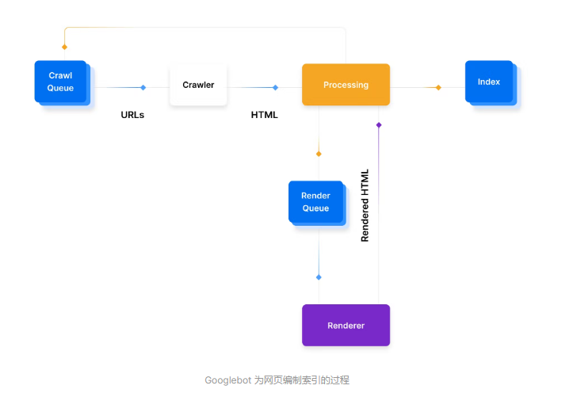
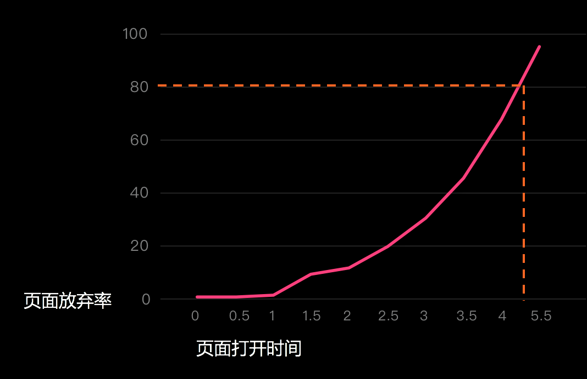
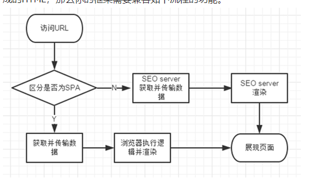
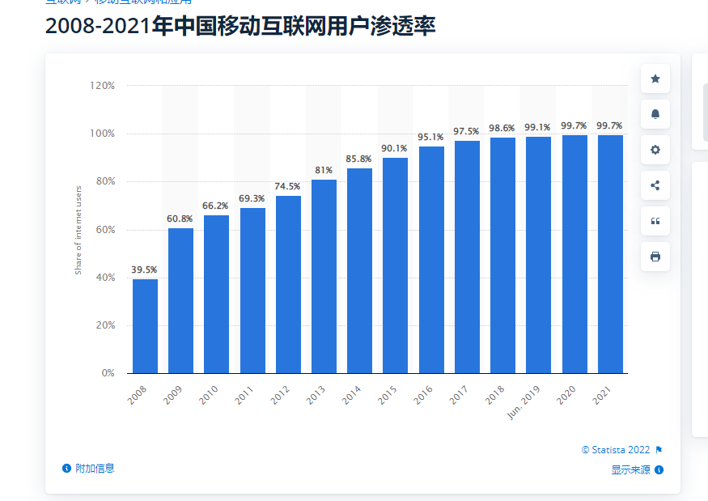

## 2022年SEO知识汇总

2022年，最新整理的SEO相关规范、知识点以及策略。

## 爬虫工作流程：

以google为例。其他爬虫都差不多



1. 查找 URL：Google 从许多地方获取 URL，包括Google Search Console、网站之间的链接或XML 站点地图。
2. 添加到抓取队列：这些 URL 被添加到抓取队列中，供 Googlebot 处理。Crawl Queue 中的 URL 通常会在那里持续几秒钟，但根据具体情况可能长达几天，特别是如果页面需要呈现、索引，或者 URL 已经编入索引则需要更新。
3. HTTP 请求：爬虫发出 HTTP 请求以获取标头并根据返回的状态码进行操作：
  * 200- 它抓取并解析 HTML。
  * 30X- 它遵循重定向。
  * 40X- 它会记录错误并且不加载 HTML。
  * 50X- 它可能稍后会回来检查状态代码是否已更改。
4. 渲染队列：搜索系统的不同服务和组件处理 HTML 并解析内容。如果页面有一些基于 JavaScript 客户端的内容，则这些 URL 可能会被添加到呈现队列中。渲染队列对 Google 来说成本更高，因为它需要使用更多资源来渲染 JavaScript，因此渲染的 URL 占 Internet 上总页面的百分比较小。
  > 渲染在这里指的是SPA，google对SPA相对有一定的支持度，百度则差很多，几乎不支持SPA。
5. 准备被索引：如果满足所有条件，页面可能有资格被索引并显示在搜索结果中。


流程简略版：

1. 抓取：Google 会使用名为“抓取工具”的自动程序从互联网上发现各类网页，并下载其中的文本、图片和视频。
2. 索引编制：Google 会分析网页上的文本、图片和视频文件，并将信息存储在大型数据库 Google 索引中。
3. 呈现搜索结果：当用户在 Google 中搜索时，Google 会返回与用户查询相关的信息。

## 状态码对SEO的影响

### 3x

`301` \ `308`为永久重定向

`302` \ `307`为临时重定向

`308\307`比`301\302`更强大的地方在于：指定 308\307 重定向代码时，客户端必须在目标位置重复完全相同的请求（POST 或 GET）

> 对于SEO来说：谷歌的John Mueller表示如果您不确定网站收到哪种请求（GET、POST 等），308 在技术上更干净。在实践中，大多数网站的请求将主要是 GET，所以两者都是一样的

### 4x

`404`状态码表示服务器找不到请求的资源，不利于SEO，通常解决方案为使用404页面，不对爬虫返回404状态。


`410`状态码表明在源服务器上不再可以访问目标资源，并且这种情况很可能是永久性的，爬虫将会删除此条url，永远不会返回爬取内容

### 5x

`500`状态码表明服务器遇到了阻止它完成请求的意外情况，不利于SEO，通常解决方案为使用500页面，不对爬虫返回500状态。

`503`表明服务器尚未准备好处理请求，当你的网站宕机并且你预测网站将宕机一段时间后，建议返回此状态码。这可以防止长期排名下降（因为 503 状态通常是临时条件）。

## SEO指南

### robots.txt

爬虫在爬到一个新的网站时，将会先去读取**根目录下的robots.txt文件**，了解到如何抓取本站后，再继续浏览页面。

`robots.txt`<sup>[17]</sup><sup>[17-1]</sup> 文件告诉搜索引擎爬虫：
  * 可以访问某个文件、文件夹
  * 不要访问某个文件、文件夹
  * 禁止某些爬虫的访问
  * 限制爬虫访问网站的频率
  * 加入网站地图的路径-因为robots协议文件是蜘蛛访问网站第一个访问的文件。这样做也会加快搜索引擎对网站的抓取周期

> 它并不是一种阻止爬虫抓取某个网页的机制，我们若想阻止爬虫访问某个网页，通常应该使用`meta`标签设置`noindex`.

> robots.txt 区分大小写,文件必须命名为`robots.txt`

> 应该在 robots.txt 文件的底部指明与此域关联的任何站点地图的位置。

一些常见的用例包括：

1. 防止重复内容出现在 SERP 中（请注意，元机器人通常是更好的选择）
2. 将网站的整个部分保密（例如，您的工程团队的临时站点）
3. 防止内部搜索结果页面出现在公共 SERP 上
4. 指定站点地图的位置
5. 防止搜索引擎索引您网站上的某些文件（图像、PDF 等）
6. 指定抓取延迟，以防止您的服务器在抓取工具一次加载多条内容时超载

### sitemap

站点地图<sup>[18]</sup>是一个文件，您可以在其中提供有关您站点上的页面、视频和其他文件以及它们之间的关系的信息，通常为根目录下的`sitemap.xml`、`sitemap.html`, **该文件应当为动态生成**的，否则网站新增内容后，爬虫根据站点地图并不能得知新的内容。

关于何时需要站点地图：

1. 您的网站真的很大，此时爬虫工具可能会忽略抓取您的一些新网页或最近更新的网页
2. 您的站点有大量内容页面存档，这些内容页面相互隔离或链接不佳。 如果您的网站页面不能自然地相互引用，您就需要在站点地图中列出它们
3. 您的站点是新站点，并且指向它的外部链接很少，网络爬虫通过跟踪从一个页面到另一个页面的链接来导航网络。因此，如果没有其他网站链接到您的网页
4. 您的网站包含大量富媒体内容（视频、图片），如果提供这些，爬虫可以在适当的情况下将站点地图中的其他信息考虑在内进行搜索

常见问题：

问题：我的网站拥有几千万个网址；我可以只提交最近更改过的网址吗？

A：您可以在少数频繁更改的 Sitemap 中列出已更新的网址，然后使用 Sitemap 索引文件中的 lastmod 标记识别这些 Sitemap 文件。随后，搜索引擎即可逐步抓取（只抓取）这些已更改的 Sitemap。

问题：我网站上同时有“http”和“https”格式的网址。需要把它们都列出来吗？

A: 不用

问题：XML Sitemap 中的“priority”提示会影响我的网页在搜索结果中的排名吗？

A: Sitemap 中的“优先级”提示只是说明特定网址相对于您自己网站上其他网址的重要性，并不会影响网页在搜索结果中的排名。

**sitemap创建完成后一定要记得添加到robots.txt 中**

### meta robots

meta标签的robots可以用来限制爬虫进行索引：`<meta name="robots" content="noindex,nofollow" />`

  * noindex 不在搜索结果中显示此页面
  * nofollow 不关注此页面上的链接

不设置meta的时候，不限制爬虫，默认是`index`和`follow`：`<meta name="robots" content="index,follow" />`

设置为all，和不设置是一样的效果，即不限制爬虫：`<meta name="robots" content="all" />`


使用场景

> 若某些页面你不希望在搜寻引擎被用户搜寻到，但这些页面事实上有很多对SEO排名有加分的因素，所以你会希望爬虫检索这些页面的资料，但别建立进搜寻引擎索引，这时候你需要meta robots 来阻止爬虫索引你的页面。

> 通常我们应该使用meta标签来禁止爬虫索引，而不是使用robots.txt

### Canonical Tags

如果您运行两个不同的网站并在每个网站中发布相同的内容，搜索引擎可以决定选择其中一个进行排名，或者直接将两者降级。

使用规范标签(Canonical Tags)，用来解决重复内容问题

```html
<link rel="canonical" href="https://example.com/products/phone" />
```

如果您的某个网页可通过多个网址访问，或者您的不同网页包含类似内容（例如，某个网页链接既有H5版，又有PC版），那么 爬虫 会将这些网页视为同一个网页的重复版本。如果您未明确告知 爬虫 哪个网址是规范网址，爬虫 会选择一个网址作为规范版本并抓取该网址，而将所有其他网址视为重复网址并降低对这些网址的抓取频率。

> 规范网页可以与当前域名不一致。

爬虫 会根据许多因素（即“信号”）选择规范网页，例如：网页是通过 HTTP 还是通过 HTTPS 提供、网页质量、站点地图中是否出现了相应网址，以及任何 rel=canonical 标签。

**会被认为重复的网页**

* 不完全相同也会被认为重复，列表页面在排序或过滤方面的细微变化并不会使该页面具有唯一性（例如，按价格排序或按项目颜色过滤）。

* 同一个网站支持了多种设备（此处是指用了一套UI做了相关适配）：

```js 
  https://example.com/news/koala-rampage
  https://m.example.com/news/koala-rampage
  https://amp.example.com/news/koala-rampage
```

* 启用搜索参数的动态网址

```js
https://www.example.com/products?category=dresses&color=green
https://example.com/dresses/cocktail?gclid=ABCD
```

* 在相同域名下转载的内容

```js
https://news.example.com/green-dresses-for-every-day-155672.html（转载博文）
https://blog.example.com/dresses/green-dresses-are-awesome/3245/（原始博文）
```

**使用规范标签的好处**

* 指定您希望用户在搜索结果中看到的网址。
> 您可能希望用户通过 `https://www.example.com/dresses/green/greendress.html`（而非 `https://example.com/dresses/cocktail?gclid=ABCD`）访问您的商品页。

* 整合类似网页或重复网页的链接信号
> 例如从其他网站指向 http://example.com/dresses/cocktail?gclid=ABCD 的链接会与指向 https://www.example.com/dresses/green/greendress.html 的链接整合成后者

* 简化单个主题的搜索指标。如果特定内容可以通过多个网址访问，获取此内容的综合指标的难度会更大。

* 管理相同域名下的转载内容

* 避免花费时间抓取重复网页。您肯定希望爬虫在您的网站上发现尽量多的内容，因此最好让爬虫将时间用于抓取您网站上的新网页（或更新后的网页）

**关于规范标签**

常见的有link标签，http头，站点地图三种方式，各有优缺点

| 方式                  | 说明                                                               | 优点                                             | 缺点                                                                                                                                                                      |
| --------------------- | ------------------------------------------------------------------ | ------------------------------------------------ | ------------------------------------------------------------------------------------------------------------------------------------------------------------------------- |
|`<link rel=canonical >` | 在所有重复网页的代码中分别添加一个 `<link>` 标记，使其指向规范网页。 | 可以映射无限多个重复网页。                       | 可能会增加网页大小。在大型网站或网址经常改变的网站上维护映射可能会比较复杂。仅适用于 HTML 网页，不适用于 PDF 之类的文件。在这种情况下，您可以使用 rel=canonical HTTP 头。 |
| rel=canonical HTTP 头 | 在网页响应中发送 rel=canonical 头。                                | 不会导致网页大小增加。可以映射无限多个重复网页。 | 在大型网站或网址经常改变的网站上维护映射可能会比较复杂。                                                                                                                  |
| 站点地图              | 在站点地图中指定您的规范网页。                                     | 易于执行和维护，尤其是在大型网站上。             | 爬虫仍必须为您在站点地图中声明的所有规范网页确定关联的重复网页。此方法向爬虫发送的信号不如 rel=canonical 映射方法发送的信号强。                                           |

**使用标准**

* 与mate标签的`noindex`互斥，将会以meta为准
* 优先选择https
* 规范网页移动版，要为其添加 `rel="alternate"`的`link`
  > <link rel="alternate" media="only screen and (max-width: 640px)"  href="http://m.example.com/dresses/green-dresses">
* 规范网页应该使用绝对地址`https://www.example.com/c.html`
* 不可以互相指定规范网页，例如A->B, 然后B->A
* 两个页面差异很大，即使设置了规范网页，爬虫也可能会忽略这个标签
* 不可将规范指向被 robots.txt 阻止或设置为“noindex”的 URL

**规范标签与 301 重定向的区别**

如果您 301 重定向页面 A-->页面 B，那么人类访问者将自动被带到页面 B 并且永远不会看到页面 A。

如果您重新规范页面 A-->页面 B，那么搜索引擎将知道页面 B 是规范，但人们将能够访问这两个 URL。确保您的解决方案符合预期的结果。

**网站迁移** 

网站迁移的时候，可以利用规范网页把所有的弃用的网址指向某个规范网页，然后对此规范网页做301即可。

好处是在停用旧网址之前就可以顺利完成迁移。规范网页不会影响到用户的正常访问。

除了服务器端设置301以外，前端也可以使用`meta`标签进行设置。当然优先使用的应该是服务器301
```html
  <meta http-equiv="refresh" content="0; url=https://example.com/newlocation" />
```


### 标签

**使用title标签**

`<title>一个名字，长度30以内</title>`

**使用描述标签**

`<meta name="description" content="一些内容,不要太长, 百度建议在80汉字以内">`

**使用关键词标签**

`<meta name="keywords" content="一些关键词,不要太多，一般在5个以内就可以了，核心不超过3个">`

> 谷歌现在会忽略这个标签

**遵循语义化标签**

`<h1>h1标签被认为是最重要的标签，建议每个页面中都要使用</h1>`

`main`、`nav`、`aside`、`article`等等，详情查看[html5语义化标签](https://developer.mozilla.org/zh-CN/docs/Web/HTML/Element)

**使用a标签时**

* 使用内链，越重要的页面内链需要越多

超链是发现收录链接的最重要入口。

* a标签需要添加锚文本

`<a href="https://example.com" content="nofollow">示例地址</a>`

锚文本应当尽量为一个文本，或者简单标签包裹一个文本。避免使用`a`标签包裹大量其他标签

* 当锚文本不足以描述链接的时候，可以使用title
  
`<a href="https://example.com" title="掌上高考">点击前往</a>`

* a标签要保证其可访问性，要能够被抓取

有效的：

`<a href="https://example.com">`

`<a href="/relative/path/file">`

无效的：

`<a onclick="goto('https://example.com')">`

`<a href="javascript:window.location.href='/products">`

`<a href="#">`

* a标签的位置很重要

a标签使用在内容中对爬虫更加友好

* a标签需要具有相关性，不相关的链接也被称为非自然链接，存在违规的情况

假设内容中使用了一个a标签内容为清华大学，`<a href="https://example.com">清华大学</a>`， 那么内容就必须与清华大学有关

* a标签指向非友链的情况下，需要使用rel="nofollow"

`<a href="https://example.com" rel="nofollow">`


**img标签**

img标签需要添加`alt`属性，用来向爬虫表示此图片代表的文案

**在`<head>`中只使用有效的标签**

`<head><div>在head中使用div就是不对的</div></head>`

### url

**url结构**

* 物理结构，即基于内容聚合的目录及文件位置决定的结构。百度搜索引擎来说，只要结构合理、有逻辑性、内容有规律可循都可以，都是友好的。无需强调扁平化结构
* 链接结构：相对于物理结构，就要说到逻辑结构：即通过内部链接形成的链接结构，一个优秀的链接结构应该是网状的。
      1）**首页链接应该链向重要的频道页**，频道页再链向下面的节点页或普通页面。同时，**频道页、节点页和普通页面都应该可以链回到首页**
      2）无论哪些页面之间互相链接，都需要一个描述恰当的**锚文本**
      3）链接不要放在JS、FLASH等搜索引擎不可见的位置，使用图片做链接入口应该完善alt标签
            *百度搜索引擎目前仅支持对部分JS和FLASH进行解析，绝大多数放在JS和FLASH里的链接都是获取不到的
      4）为**重要页面留更多入口**。百度搜索引擎认为，获得更多内部投票的网页相对来说更加重要
      5） “**离首页越近**”的网页，越容易受到百度重视。这个“近”指的是页面离首页的点击距离。即使URL所在目录层级较深，只要在首页有入口，百度也认为这是一个非常重要的页面。
      6）不要产生可怕的**孤岛页面**。虽然百度在提交入口、社会化挖掘方面做了许多工作，但链接抓取依然是百度获得新页面的最重要渠道

建议：
  * 使用简单、说明性字词，保持清晰的语义，尽量帮助爬虫理解页面
    > 示例：`/learn/basics/create-nextjs-app`优于  `learn/course-1/lesson-1`
  * 仅使用单词、数字、本地化词语
  * 使用短横杠分隔单词
  * url保持一致，不要同时拥有`/page`、`/page/`、`/page/index.html`、`http`、`https`
  * 避免使用then、and、or 
  * 层级尽可能保持在3层以内
  * 使用favicon
  * 不基于参数：使用参数来构建 URL 通常不是一个好主意，尽量使用静态网址，但是在保存语义的时候请选择使用动态网址<sup>[22]</sup>
  * 使用小写字母。在某些情况下，大写字母可能会导致重复页面出现问题。例如，moz.com/Blog 和 moz.com/blog 可能被视为两个不同的 URL，这可能会产生重复内容的问题。
  * url结构规律化：同一个网页有不同url，会造成多个url同时被用户推荐导致权值分散；同时百度最终选择展现的那个url不一定符合你的预期。
  * 站点应该尽量不把sessionid和统计代码等不必要的内容放在url，如果一定要这样做可以通过robots禁止百度抓取这些非规范url
  * 最好能让用户从url即可判断出网页内容，便于蜘蛛解析的同时便于用户间传播
  * url尽量短、尽量简单、越平常越好，URL长度要求从www开始到结束，总长度不超过1024个字节<sup>[20][21]</sup>
    * 蜘蛛喜欢：http://tieba.baidu.com.com/f?kw=百度
    * 蜘蛛不喜欢：http://tieba.baidu.com/f?ct=&tn=&rn=&ln=&cn=0&kw=百度&rs2=&un=&rs1=&rs5=&sn=&rs6=&nvselectvalue=0&oword=百度&tb=cn
  * 不要添加蜘蛛难以解析的字符，如
    * http://mp3.XXX.com/albumlist/234254;;;;;;;%B9&CE%EDWF%.html
    * http://news.xxx.com/1233,242,111,0.shtml
  * 动态参数不要太多太复杂，目前百度对动态url已经有了很好的处理，但是参数过多过复杂的url有可能被蜘蛛认为不重要而抛弃
  * url不要加#号，百度爬虫只取#前的部分收录

不建议
  * 不使用不易读的、冗长的 ID 编号 `https://www.example.com/greendress-2-3` \ `https://www.example.com/greendress?a=2995_dds84$$5`
  * 不要使用下划线 (_)等乱七八糟的符号，爬虫不识别下划线作为单词的分隔符 `https://www.example.com/green_dress`
  * 不要把单词链接在一起 `https://www.example.com/greendress`
* 不建议URL中含有中文字符，中文字符容易出现识别问题

* 关于使用动态参数
  * 使用动态参数来渲染不同的视图，因为参数不参与爬虫的语义识别，搜索引擎可能会混淆他们并降低排名
    > 不同的视图应当使用不同的路由来渲染
  * 使用动态参数会造成url过长
    > url过长本身并不影响SEO，只是因为短了更可能被点击和共享，(点击这事存疑，但是共享的概率可能会变大),反向优化SEO而已
  * `home?a=2&b=3`、`home/2-3`渲染相似的视图时，都影响到了爬虫对语义的识别，且会造成大量重复页面（例如数据差不多的页面和无数据时）
    > `/school/102`和`/school?id=102`实际上后者招爬虫喜爱，此时无需配合规范标签使用
    > SEO最喜欢的是：在保证语义的情况下尽量简短，如果要使用动态参数：参数不能复杂且必须有效
    > URL权重：语义>参数>长度。 
    > 落地页页面示例： https://www.zhihu.com/people/tie-mu-jun-58
    > 落地页页面示例： https://www.zhihu.com/question/472798741
    > 落地页页面示例： https://www.36kr.com/p/1858460067485314
    > 落地页页面示例： https://www.36kr.com/newsflashes/1860674508134021 
    > 百度搜索示例： https://ziyuan.baidu.com/college/courseinfo?id=1394
    > 百度统计示例： https://tongji.baidu.com/main/overview/10000058728/overview/index?siteId=15325680
    > 落地页页面示例： https://detail.tmall.com/item.htm?id=671853630330&ali_refid=a3_430582_1006:1251480150:N:rpE3ZjAG6mphNqXLgvRjiA==:e0487487399a47ff6e317b4fe81cb353&ali_trackid=1_e0487487399a47ff6e317b4fe81cb353&spm=a230r.1.14.6
    > 落地页页面示例： https://item.jd.com/10031221800227.html
    > 落地页页面示例： http://product.dangdang.com/29425922.html
    > 不要介意长度示例：https://www.ghacks.net/2022/07/17/facebook-has-started-to-encrypt-links-to-counter-privacy-improving-url-stripping/
    > 分tab示例： http://fankui.help.sogou.com/index.php/web/web/index?type=5
    > 筛选条件示例： http://search.dangdang.com/?key3=%BD%AD%CB%D5%B7%EF%BB%CB%CE%C4%D2%D5%B3%F6%B0%E6%C9%E7&medium=01&category_path=01.01.14.00.00.00#J_tab
    > 筛选条件示例： https://search.jd.com/search?keyword=%E7%AC%94%E8%AE%B0%E6%9C%AC&wq=%E7%AC%94%E8%AE%B0%E6%9C%AC&cid3=1105
    > 使用伪静态路由，主要是考虑用户体验方面。还有就是使用的ssr框架，不得不这么做。

**关于子域**

子目录的内容足够丰富，且与主域的主题关联性不强时，才可以使用子域。子域的重要程度并不一定比目录强，百度会有自己的判断指标

对于我们自己的SEO来说，最大的坏处是需要搞两个站点。而且权重不继承

**反链**

互联网是通过链接连接的。如果没有从一个网站到另一个网站的链接，互联网可能就不会存在。获得更多链接的网站往往代表着更受用户信任的网站。

> 需要更多的推广自己的网站，通过邮件、论坛等，都会带来反链
> 百度在垃圾链接反链监测策略稍微落后，目前垃圾链接策略在百度搜索提升排名依然有效

### 用户体验

截止2022年，最新的算法总结一句话：爬虫认为网站让用户越开心，排名就越高

**网站性能**

爬虫会尝试提高性能更好的网页的排名，网站性能对SEO的影响主要来自几个指标：
* 最大元素加载时间`LCP`(页面加载性能)、
* 首次输入延迟`FID`(页面交互性能)、
* 累积布局偏移`CLS`(页面视觉 稳定性)

> 如果3秒内离开网站，也代表了用户不喜欢你的内容，从而可能导致降权。



**视觉交互**

* 美化图片
* 选择字号、字体（14号字号目前是研究最优结论）
* 设计布局
* 减小偏移

**https**

使用https + http2 的网站有利于排名

### 网站改版

**改性别也别改域名**

* 做好301跳转规则后，在站长工具提交改版规则和死链处理。
* 改版跳转关系尽量保留越长越好，起步三个月最好半年以上。
* 网站换域名后需要重新申请新闻源
* 网站换域名后不用等百度收录站点，可以立即做跳转；然后到改版工具中提交改版规则，改版校验过程中会抓取校验新连接，如果校验成功，会在最长48小时后线上生效改版规则。

**注意事项**

* 网站改版尽量别动URL
* 新旧URL要有规则可循
* 做好新旧域名对应页面的301跳转关系
* 在百度站长工具中提交改版规则
* 检查死链，提交死链
* 提交新的sitemap.xml，原旧站的sitemap.xml在改版后1周内去除掉
* 百度索引数据大概在两周内出，站越大越快

## 关于SPA

使用SPA必然对SEO带来伤害，但是SPA效果酷炫、全JS性能高速度快、运算分散，异步加载，又省硬件又省流量各种好处。

都是博弈、抉择。亚马逊更注重tracking，放弃了SEO，所以他们的URL非常乱。而facebook为了防止追踪，也使用了很多不利于SEO的URL

当必须使用SPA时：

1. 在做一个服务端的镜像网站
  > 爬虫支持，但是后续的维护会是个大坑

2. 携程目前的方案



服务前判断是否为蜘蛛，如果是就走SEO的URL，如果不是就走用户的URL

使用两套地址对应一套页面，用户和蜘蛛看到的是一样的内容，但是不一样的URL。


## 关于快照

百度快照只是一个索引，不代表被搜索网站的即时页面

百度快照的生成流程跟网页的索引更新是同步的，生成索引的同时会将爬虫最新一次抓取的网页内容推给快照生成程序。所以可以说网页建索引的速度决定了快照更新的速度。

快照生成模块会将网页内容通过浏览器展示给用户，目前快照展示模块只能根据静态的html进行网页渲染（行话是指通过iframe方式加载），所以对于一些相对路径下的js，css和图片等素材是无法进行加载的

没有快照只是没有针对该网页生成快照，并不是针对该网站进行了某些特殊处理。

## 网站常规指南小贴士

* 避免使用干扰性插页式广告和对话框
* 浏览器兼容性，在不兼容的浏览器中需要添加指导性的页面
* 避免常见重复内容，重复内容通常是指网域内或网域间与使用同一种语言的其他内容完全匹配或大致类似的有一定体量的内容
  > 既可生成常规网页，又可针对移动设备生成精简版网页的论坛。不算重复
  > 网店中通过多个不同网址显示或链接到的商品。不算重复
  > **联合供稿的解决方案**：如果您以联合供稿方式在其他网站上显示您的内容，那么，在每次相关搜索中，爬虫都会始终显示他认为最适合用户的版本，这有可能是您的首选版本，也有可能不是。不过，建议您确保以联合供稿形式展示内容的每个网站都包含一个指回原始文章的链接。您也可要求其他网站的所有者对包含您的联合供稿内容的网页使用 noindex 标记，从而阻止搜索引擎将他们的内容版本编入索引。
* 提交结构化数据

谷歌支持我们在网页上使用`application/ld+json`添加结构化数据，向爬虫提供有关该网页含义的明确线索，从而帮助爬虫理解该网页

百度只能使用站长工具提交结构化数据[结构化数据工具](https://ziyuan.baidu.com/wiki/197)

* 避免欺骗性重定向 

将访问者引导到其他网址（而非其原本请求的网址）的行为，例如向搜索引擎显示一种内容，却将用户重定向到明显不同的其他内容。

* 避免隐藏文字和链接
  * 在白色背景上显示白色文字
  * 将文字放在图片后面
  * 使用 CSS 将文字放在画面外
  * 将字体大小设置为 0
  * 通过只链接一个小字符（例如，段落中间的连字符）隐藏链接

* 自然点击率决定了排名的大部分，研究表明用户更更能点击包含数字的结果，例如`2022年大学生就业数据`，`19条SEO的黄金法则`，`3年后房价预测`。好的标题，好的简介带来更好的点击率，**点击率**提升排名的速度远大于**定期更新**大于**页面性能**
* **固定**的更新频率和更新周期，以及更新、升级和重新发布旧博客文章，再加通过邮件、论坛等推广将会得到更多的流量与爬虫好感度。
* 反链的数量越多，被收录 + 排名越好
* 在文章中放入至少三个相关的资源链接。这会向爬虫表明页面是用户有用信息的中心
* 使用语义化标签，让爬虫更了解页面
* 第一链接优先规则：假设您有两个链接指向您网站上的一个页面……并且这两个链接都在同一个页面上。根据First Link Priority Rule，只有第一个链接会被爬虫索引
* 避免孤立的页面
* 单独优化排名靠后的页面、优化点击率来获取更高的流量
* 设置的关键词需要在内容中多次出现
* 某些时候：使用h1标签，会被当做标题抓取，h2标签会被当做副标题 - 百度会对标题做出一些优化
* 开发小程序关联H5站点、且[保持H5和小程序web化的链接样式一致](https://ziyuan.baidu.com/college/articleinfo?id=2881)
* 关于pc分页：
  > 为每个网页提供唯一网址，例如，添加 ?page=n 查询参数，因为爬虫会将分页序列中的网址视为不同的网页
  > 不要将分页序列的第一个网页用作规范网页
* 关于h5分页：
  > 爬虫支持分页模式、点击加载更多按钮、无线滚动三种形式，可根据产品自行选择
  > 无线滚动更适合移动端，但是并非使用于所有产品: 对于目标导向的查找任务，例如需要人们定位特定内容或比较选项的任务，不建议使用无休止的滚动
  > [无限滚动并不适用于每个网站](https://www.nngroup.com/articles/infinite-scrolling/)
* 域名年龄在百度排名中也很重要，**存疑**。
* 百度SEO整合了百度的其他产品，所以多在百度其他产品上进行推广反链有利于排名。（Barnacle SEO, 打不过就加入）
* 申请百度开放小工具，可以在百度的SERP中显示更丰富的网页
* 谷歌的第二页流量非常少，百度的第二页第三页仍然有相对较高的流量，因为许多百度用户已经训练自己跳过典型的百度属性和广告，以获得真正的自然结果
* 百度搜索结果配图具体要求为，在文章主体位置；图片与内容相关；图片上没有文字；图片比例接近**121*91**
  > 尽量在文章中添加相关图片
* 使用面包屑导航
* **site站点与搜索关键词展现的站点，描述会有所差异，百度会有优化**
* 站点需要有明确的领域或行业，如果内容涉及多个领域或行业，领域模糊、领域专注度低则会降低权重
* 过多的**垃圾搜索结果页**会命中p爬虫惩罚策略，在内容不够多之前，不要尝试做搜索结果聚合页（结果筛选页面）
* 资讯内容需要加入时间，让爬虫知道这篇资讯是新的，爬虫对老旧信息收录不友好
* pc 和 移动站点适配，不要做多对一。哪怕麻烦一些也要一对一做适配
* 就算是洗稿伪原创，也要让内容尽可能体现出更多的准确的信息
  > 示例：关于马里奥游戏的SEO介绍页面。
  > A站：“马里奥开始了他有史以来最大的冒险，这次他带来了一个朋友。”
  > B站：“超级马里奥世界是一款由任天堂开发和发布的平台游戏，作为超级任天堂娱乐系统的打包发布标题。”
  > 同样被收录B站的排名将会高于A站

### 移动端指南

移动端的重要性2021年移动互联网渗透率99.7%



* 移动站与PC站需要分开，使用302进行跳转
* URL长度不要超过256个字节
* 建议移动站使用单独的TDK

站长平台里面-搜索服务-数据统计-流量和关键词：后台选取你的移动站点，点击页面类型的PC页，如果数据很多，那就表明你的移动页面被识别为PC页，需要检查移动特征的代码是不是没有加好


## 理想优化的网页

### url满足：

1. Baiduspider能找到所有网页
2. Baiduspider知道哪个网页是重要的
3. Baiduspider能顺利提取网页内容
4. Baiduspider能在网页中提炼有用信息 


### 内容满足：

* 与特定主题（通常是产品或单个对象）高度相关
* 在标题标签中包含主题
* 在 URL 中包含主题
* 在图像替代文本中包含主题
* 在整个文本内容中多次指定主题
* 提供有关给定主题的独特内容
* 链接回其类别页面
* 链接回其子类别页面（如果适用）
* 链接回其主页（通常通过在页面左上角显示网站徽标的图像链接完成）

### 爬虫会优先抓取的网站特点：

* 网站更新频率：经常更新高价值的站点，优先抓取；
* 受欢迎程度：用户体验好的站点，优先抓取；
* 优质入口：优质站点内链接，优先抓取；
* 历史的抓取效果越好，越优先抓取；
* 服务器稳定，优先抓取；
* 安全记录优质的网站，优先抓取；

## seo自查点

* 标签、url
* 用户体验
  * 性能 - lcp、fcp等
  * 视觉 - 图片、字号、字体、布局、偏移等
  * 交互 - fid、tbt、交互舒适性等
* robots.txt \ sitemap
* 页面内容
  * 质量
  * 更新周期
* 链接,**内容为王超链为皇**
* 运营、推广
* 排名优化
* 关键词挖掘
  * 关键词、长尾词
* 国际化、无障碍（影响不大）

## 关于爬虫的识别

对于爬虫的识别方案，通常有两种形式：<sup>[3]</sup>

1. UA
  
使用进行判断,各大浏览器spider都有自己的UA标识。可以根据UA进行判断

2. 使用双向DNS解析认证

通过DNS反查IP，然后再通过对域名的正向DNS查找来验证蜘蛛

window 执行nslookup命令即可

```js
nslookup 111.206.198.69

// 输出如下：
// 服务器:  cmcc.sd.chinamobile.com
// Address:  211.137.191.26

// 名称:    baiduspider-111-206-198-69.crawl.baidu.com
// Address:  111.206.198.69

```
> linux 用host ip
> mac 用dig -x ip

**不要直接使用ip,因为爬虫的IP地址范围动态变化是不固定的**

# 资料

* [1.百度搜索算法详解](https://ziyuan.baidu.com/college/courseinfo?id=2988&page=1)
* [2.百度小程序关联H5](https://ziyuan.baidu.com/college/articleinfo?id=3140)
* [3.百度爬虫UA](https://ziyuan.baidu.com/college/articleinfo?id=1002)
* [4.百度平台工具使用手册](https://ziyuan.baidu.com/college/courseinfo?id=1988&page=22)
* [5.百度移动搜索建站优化白皮书](https://ziyuan.baidu.com/college/articleinfo?id=1707&page=1 )
* [6.百度小程序替换H5](https://ziyuan.baidu.com/college/articleinfo?id=2812)
* [7.百度搜索引擎原理](https://ziyuan.baidu.com/college/courseinfo?id=1388)
* [8.搜狗站长指南](http://help.sogou.com/guide.html#3)
* [9.1100万结果中分析停留时间长的排名更高](https://backlinko.com/search-engine-ranking)
* [10.字体如何影响用户体验](https://www.webfx.com/blog/web-design/fonts-ux/)
* [11.世界领先的用户体验](https://www.nngroup.com/)
* [12.2022-5-6停用的sitemap中部分标记](https://developers.google.com/search/blog/2022/05/spring-cleaning-sitemap-extensions?hl=zh_cn)
* [13.撰写用户爱看的标题](https://ziyuan.baidu.com/college/articleinfo?id=1264)
* [14.截止至2022年第一季度。已经有3.5亿+的域名被注册](https://www.businesswire.com/news/home/20220629006013/en/Verisign-Reports-Internet-Has-350.5-Million-Domain-Name-Registrations-at-the-End-of-the-First-Quarter-of-2022)
* [15.中国爬虫占比报告](https://gs.statcounter.com/search-engine-market-share/all/china/#monthly-202107-202207)
* [16.谷歌SEO指南](https://developers.google.com/search/docs/beginner/seo-starter-guide)
* [17.moz-robotstxt](https://moz.com/learn/seo/robotstxt)
* [17-1.robotstxt.org](http://www.robotstxt.org/)
* [18.sitemap](https://www.sitemaps.org/index.html)
* [19.moz-SEO学习网站](https://moz.com/learn/seo)
* [20.百度的建议1：](https://ziyuan.baidu.com/college/courseinfo?id=1394&page=2)
* [21.百度的建议2：](https://ziyuan.baidu.com/college/articleinfo?id=1263)
* [22.google的建议](https://developers.google.com/search/blog/2008/09/dynamic-urls-vs-static-urls)
* [PC到H5的跳转在服务端中实现](https://ziyuan.baidu.com/college/articleinfo?id=2759)