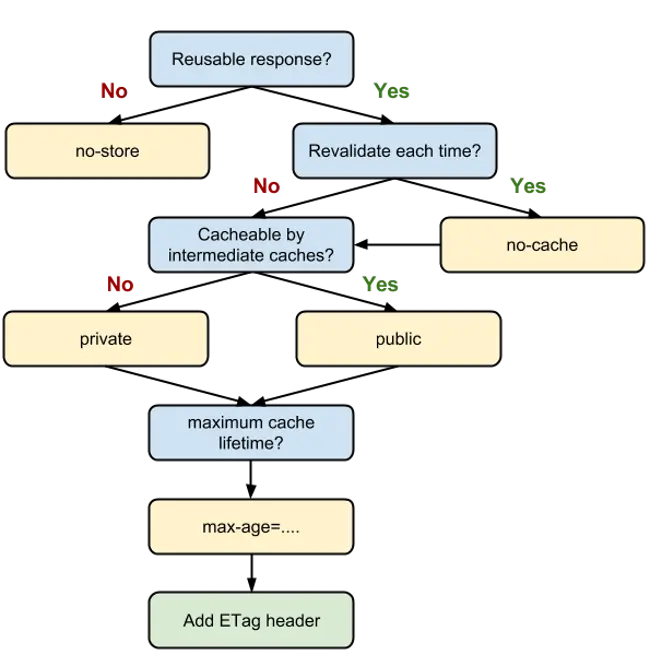

## http1.0 使用强制缓存

expires 强制缓存，单位是毫秒，如果客户端跟服务端时间不一致的情况下，会出现bug，前台无法感知

```javascript
  // http 1.0 强制缓存方案，单位毫秒，如果客户端与服务端时间不一致就会出BUG
  res.setHeader('Expires', new Date(Date.now() + 10 * 1000).toUTCString())
```

## http1.1 使用强制缓存与协商缓存

Cache-Control 强制缓存，单位秒，会覆盖expires, 与协商缓存间使用值更大的一个，前台可感知
  
```javascript
  // http 1.1 强制缓存方案，与协商缓存 谁大用谁，会覆盖Expires,单位秒
  res.setHeader("Cache-Control", "max-age=5")
```
> s-maxage 优先级高于 max-age，两者同时出现时，优先考虑 s-maxage。如果 s-maxage 未过期，则向代理服务器请求其缓存内容。

以下Cache-Control值可以帮助微调未版本控制的 URL 的缓存位置和方式：

  * no-cache. 这会指示浏览器每次在使用 URL 的缓存版本之前都必须与服务器重新验证。
  * no-store. 这会指示浏览器和其他中间缓存（如 CDN）从不存储文件的任何版本。
  * private. 浏览器可以缓存文件，但中间缓存不能。
  * public. 响应可以由任何缓存存储。

  > public 与 private 是针对资源是否能够被代理服务缓存而存在的一组对立概念。 如果我们为资源设置了 public，那么它既可以被浏览器缓存，也可以被代理服务器缓存；如果我们设置了 private，则该资源只能被浏览器缓存。private 为默认值。设置了 s-maxage，没设置 public，那么 CDN 还是可以缓存的。因为明确的缓存信息（例如“max-age”）已表示响应是可以缓存的。

last-modified 协商缓存 以后台设定的过期时间为准，前台无法感知

```javascript
    // http 1.1 协商缓存 - 文件最终修改时间
    res.setHeader("Cache-Control", "no-cache")
    res.setHeader("last-modified", new Date().toUTCString())
    if (new Date(req.headers['if-modified-since']).getTime() + 3000 > Date.now()) {
      res.statusCode = 304
      res.end()
      return
    }
```
  
Etag 协商缓存 以文件的最终修改时间为准，前台无法感知

```javascript
  // http 1.1 协商缓存 - 文件内容概览hash对比
  res.setHeader("Cache-Control", "no-cache")
  const crypto = require("crypto")
  const hash = crypto.createHash("sha1").update(content).digest("hex");
  res.setHeader("Etag", hash)
  if (req.headers["if-none-match"] === hash) {
    res.statusCode = 304
    res.end()
    return
  }
```

**no-store与no-cache**

no-cache 绕开了浏览器：我们为资源设置了 no-cache 后，每一次发起请求都不会再去询问浏览器的缓存情况，而是直接向服务端去确认该资源是否过期（即走我们下文即将讲解的协商缓存的路线）。

no-store 比较绝情，顾名思义就是不使用任何缓存策略。在 no-cache 的基础上，它连服务端的缓存确认也绕开了，只允许你直接向服务端发送请求、并下载完整的响应。

## 缓存使用决策
  
  

  当我们的资源内容不可复用时，直接为 Cache-Control 设置 no-store，拒绝一切形式的缓存；

  否则考虑是否每次都需要向服务器进行缓存有效确认，如果需要，那么设 Cache-Control 的值为 no-cache；

  否则考虑该资源是否可以被代理服务器缓存，根据其结果决定是设置为 private 还是 public；

  然后考虑该资源的过期时间，设置对应的 max-age 和 s-maxage 值；

  最后，配置协商缓存需要用到的 Etag、Last-Modified 等参数。

## Cache-Control示例
  | Cache-Control value      | 解释                                                                    |
  | ------------------------ | ----------------------------------------------------------------------- |
  | max-age=86400            | 响应可以被浏览器和中间缓存缓存最多 1 天（60 秒 x 60 分钟 x 24 小时）    |
  | private, max-age=600     | 响应可以被浏览器（但不是中间缓存）缓存长达 10 分钟（60 秒 x 10 分钟）。 |
  | public, max-age=31536000 | 响应可以由任何缓存存储 1 年。                                           |
  | no-store                 | 不允许缓存响应，必须在每次请求时完整获取。                              |