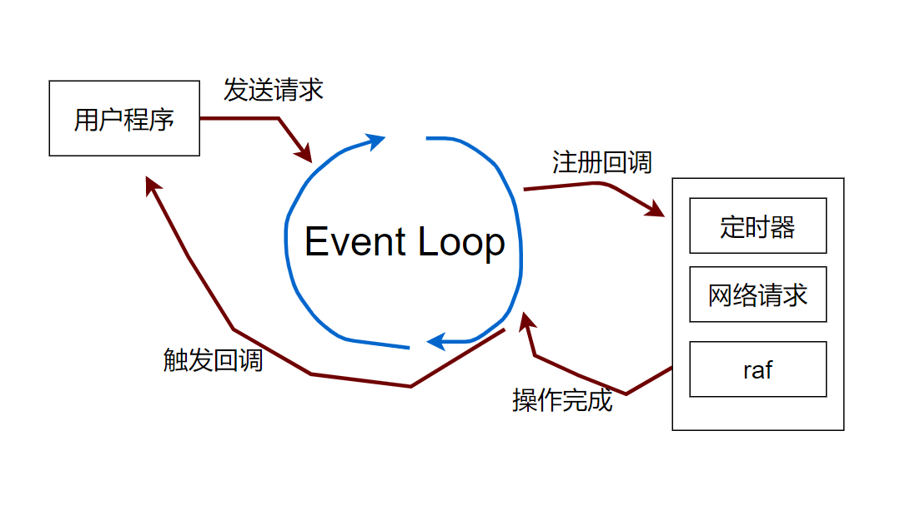
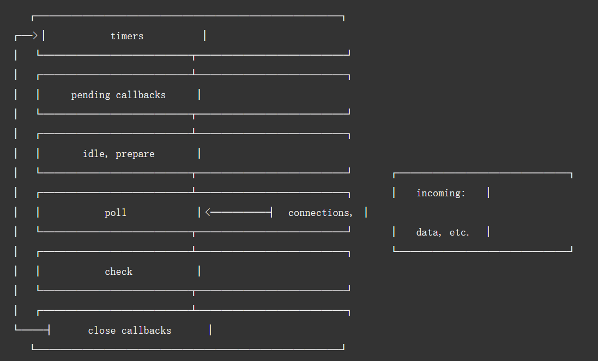

## Event Loop

Event Loop是什么？

  * Event Loop是一个与用户程序在同一个线程上的单线程程序
  * Event Loop是驱动javascript程序执行的动力源

Event Loop**提供了主程序并发的能力**,如果不用Event Loop，真正使用单线程的话，就会阻塞用户行为，这是不能接受的。

用户程序创建定时器、发送网络请求等等跟操作系统相关的操作，都需要发送到给Event Loop，Event Loop循环处理所有请求发送给操作系统，并注册一个回调函数，操作系统会使用单独的线程处理对应的请求，处理完成后回通知Event Loop。Event Loop再触发用户程序的回调

> 为了防止线程太多，Node.js内部有一个**线程池**，用于处理需要OS支持的行为。

宏观上node与浏览器的事件循环设计是一样的，流程如下图：

**node**


**浏览器**



接下来，细分一下node与浏览器事件循环的差异
## Node事件循环
  

  这张图本质上表达的是：NodeJs消息循环中对任务优先级的控制(**多级优先队列**)，也就是Node.js如何做到异步且具有非阻塞的 I/O的原因。

  从上图可以看出第一级是**timer**, 也就是说只有当程序中所有的timers任务都执行完了，才会执行下一个级别的任务，也就是Pending callbacks,如此一级一级执行下去，直到全部完成。

  * timers阶段
    
    一个timer指定一个下限时间而不是准确时间，在达到这个下限时间后执行回调。在指定时间过后，timers会尽可能早地执行回调，但系统调度或者其它回调的执行可能会延迟它们。

    > 注意：技术上来说，poll 阶段控制 timers 什么时候执行。

    > 注意：这个下限时间有个范围：[1, 2147483647]，如果设定的时间不在这个范围，将被设置为1。

  * pending callbacks阶段

    这个阶段执行一些系统操作的回调。

  * poll阶段

    poll 阶段有两个主要功能：（1）执行下限时间已经达到的timers的回调，（2）然后处理 poll 队列里的事件。
    当event loop进入 poll 阶段，并且 没有设定的 timers（there are no timers scheduled），会发生下面两件事之一：

      * 如果 poll 队列不空，event loop会遍历队列并同步执行回调，直到队列清空或执行的回调数到达系统上限；

      * 如果 poll 队列为空，则发生以下两件事之一：
    
        * 如果代码已经被setImmediate()设定了回调, event loop将结束 poll 阶段进入 check 阶段来执行 check 队列（里面的回调 callback）。
        
        * 如果代码没有被setImmediate()设定回调，event loop将阻塞在该阶段等待回调被加入 poll 队列，并立即执行。

    但是，当event loop进入 poll 阶段，并且 有设定的timers，一旦 poll 队列为空（poll 阶段空闲状态）：event loop将检查timers,如果有1个或多个timers的下限时间已经到达，event loop将绕回 timers 阶段，并执行 timer 队列。

  * check阶段
  
    这个阶段允许在 poll 阶段结束后立即执行回调。如果 poll 阶段空闲，并且有被setImmediate()设定的回调，event loop会转到 check 阶段而不是继续等待。
    
    > setImmediate() 实际上是一个特殊的timer，跑在event loop中一个独立的阶段。它使用libuv的API来设定在 poll 阶段结束后立即执行回调。

    通常上来讲，随着代码执行，event loop终将进入 poll 阶段，在这个阶段等待 incoming connection, request 等等。但是，只要有被setImmediate()设定了回调，一旦 poll 阶段空闲，那么程序将结束 poll 阶段并进入 check 阶段，而不是继续等待 poll 事件们 （poll events）。

  * close callbacks 阶段
    
    如果一个 socket 或 handle 被突然关掉（比如 socket.destroy()），close事件将在这个阶段被触发，否则将通过process.nextTick()触发

> ps：真正编写node程序的时候，不需要太在意上述的事件流程，我们只需要知道，node会把让用户更满意，更着急的事件先完成即可。我们不能对异步程序的执行顺序进行任何假设，同时要把所有异步程序转成同步程序，少写callback 多写async\await、yield即可。

## 浏览器事件循环
  
.jpg)

事件循环的本质就是JavaScript引擎在 **等待任务**、**执行任务**、**进入休眠状态等待更多任务**这几个状态之间转换的无限循环。

> 出现任务 —— 引擎处理它们 —— 等待更多任务（即休眠，几乎不消耗 CPU 资源）—— 出现新的任务

JavaScript引擎在大多数时候是不执行任何操作的，它仅在脚本/处理程序/事件激活时执行

例如：

  * 当外部脚本 `<script src="...">` 加载完成时，任务就是执行它。
  * 当用户移动鼠标时，任务就是派生出 mousemove 事件和执行处理程序。
  * 当安排的（scheduled）setTimeout 时间到达时，任务就是执行其回调。
  * 等等...

如果一个任务到来时，引擎正处于繁忙状态，比如正在处理的上一个任务比较耗时，那么新来的任务就会被排入队列。

多个任务组成了一个队列，这就是所谓的**宏任务队列(macrotask queue)**

每一个宏任务在执行过程中有可会产生微任务，所有产生的微任务会添加到**微任务队列(microtask queue)**
  
  > 有点蒙哈？简单说：如果`<script></script>`标签包裹的代码中有一个promise，且这个promise在当前宏任务执行期间被解决(resolve)了,他就会被添加到当前的微任务队列，待宏任务执行完成就会被执行，代码示例如下
  
  ```js
   <script>
      // 这是第1个宏任务
      let num = 1;
      new Promise((resolve,reject)=>{
          resolve(1)
      }).then(e=>{
          num+=e
      })
      // 此时num === 1,因为这是当前宏任务的最后一行代码，执行完这一行才会去执行 .then中的num+=e
      console.log(num) //1 
   </script>
   <script>
      // 这是第2个宏任务
      // 此时num === 2，以为第一个宏任务执行完成之后 执行了微任务队列，所以第二个宏任务执行的时候 num+=e 已经被执行了
      console.log(num) //2 
   </script>
  ```

当前执行的宏任务一旦执行完成，就会立刻执行**宏任务执行过程中产生的**微任务队列，简单理解就是：宏任务队列中每执行一个宏任务，就会把这个宏任务所产生的微任务队列全部执行，然后才会执行宏任务队列中的下一个宏任务

了解了宏任务与微任务队列的执行情况，就需要再知道渲染（render）是什么时候发生的：当每一队微任务队列被清空后（如果有微任务队列的话，没有就是宏任务执行完成后），引擎会查看是否需要进行render,如果需要，就会先执行render操作。


## 浏览器中的宏任务
  * script脚本
  * 定时器
  * Dom操作
  * UI交互事件
  * I\O
  * postMessage

## 浏览器中的微任务
 * promise
 * queueMicrotask
 * Mutation Observer API 

## 总结 & 补充

  * **GUI渲染线程与JS线程是互斥的**，javascript引擎执行任务的时候,渲染引擎不能同时执行，

  * 执行顺序
    1. 宏任务队列中队首的宏任务
    2. 对首宏任务执行中产生的微任务队列
    3. 引擎检查是否需要render，检查是否有事件回调函数（例如click事件回调）
    4. 出队当前宏任务，执行宏任务队列中的下一个宏任务
    5. 如果没有下一个宏任务了，就进入休眠状态，等待程序产生宏任务再次执行第1步
   
  * 点击事件算宏任务还是微任务？
    * 点击事件是一个异步的任务，拥有一个不确定执行时间的回调函数，它不属于宏任务或者微任务，它会在上述执行顺序中的第3步，微任务队列执行完成引擎检查任务时执行。
  
  * 常用的添加宏任务方式
    * 使用零延迟的setTimeout

  * 常用的添加微任务方式
    * promise
    * queueMicrotask

  * node是单线程的么？
    * node 进程并不是单线程的，只是node提供给用户使用的只有一个线程。
  
  * node为什么不用多线程呢？
    * 在IO密集型的场景下，nodeJS这种event loop的设计，IO多路复用，效率是最高的，而且还不需要考虑多线程的线程通信，线程锁等操作
  
  * node为什么使用多级优先队列的事件循环机制？
    * 举例：假如用户使用了，**用户的定时器**与**读取文件回调函数**，那么优先执行谁？如果使用朴素的公平性，也就是先到先得，就会造成**定时器执行更加不稳定**的结果，

  * 异步转同步会导致性能下降么？
    * 异步转同步，不会阻塞程序，也不会降低性能，反而会使我们避免回调地狱。
