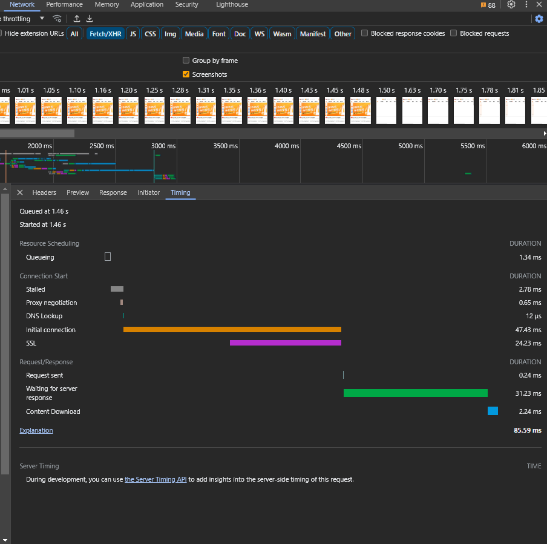
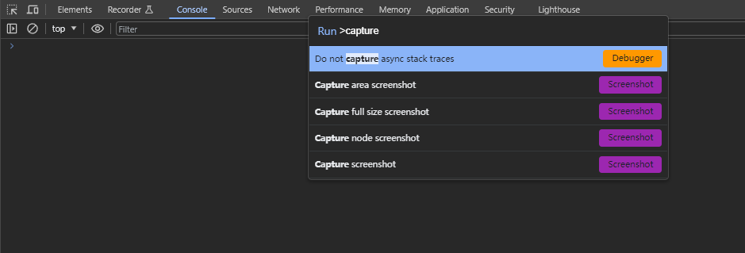
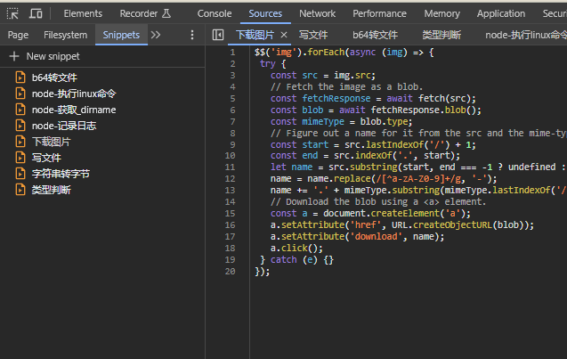

## chrome 控制台使用技巧

以下技巧随时间更新，存在于不同版本的chrome上，建议更新至最新版本chrome后，再进行学习。
## 预览请求的时间分解

时序故障阶段解释

**Queueing**: 浏览器在以下情况下将请求加入队列排队：
  * 有更高优先级的请求.
  * 这个站点已经打开了六个TCP连接，这是http请求限制。 仅适用于HTTP/1.0和HTTP/1.1。
  * 浏览器在磁盘缓存中短暂分配空间

**Stalled**: 请求可能由于排队中描述的任意一个原因而被延迟

**DNS Lookup**: 浏览器正在解析请求的IP地址。  

**Initial connection**: 浏览器正在建立连接，包括TCP握手/重试和协商SSL。  

**Proxy negotiation**: 浏览器正在与代理服务器协商请求。

**Request sent**: 正在发送请求。

**ServiceWorker Preparation**: 浏览器正在启动 service worker。

**Request to ServiceWorker**: 请求正在被发送到service worker。  

**Waiting (TTFB)**: 浏览器正在等待响应的第一个字节，TTFB代表第一个字节的返回时间， 这个计时包括1次延迟往返和服务器准备响应所花费的时间。  

**Content Download**: 浏览器正在接收响应，要么直接来自网络，要么来自service worker。 这个值是读取响应体所花费的总时间。 大于预期值可能表示网络较慢，或者表示浏览器正在忙于执行其他工作，从而延迟了响应的读取。  

**Receiving Push**: 浏览器通过HTTP/2服务器推送接收这个响应的数据。  

**Reading Push**: 浏览器正在读取之前收到的本地数据。

## 截图

打开`F12`，按 `shift + ctrl + p` 唤出命令运行面板，搜索`capture`, 根据需要选择截图方式即可，其中 `full size` 是整站截图，但是如果滚动条不在body上，而是在页面元素中，则不会实现整个网站截屏。

## 录屏与重放

打开`F12`，按 `shift + ctrl + p` 唤出命令运行面板，搜索`Recorder`, 点击后进入`Recorder`功能界面，点击`create a new recoring`进入录屏准备页，点击下方的`start recording`开始录屏。想要结束时再点击`end recording`结束录屏。

* 点击右上角 `slow replay` 开启重放。可以选择重放速度。
  
* 点击`performance panel`查看性能面板 

* 点击`replay setting` 进行录屏设置

* 右击每一个步骤，可以进行编辑

* 可以点击上方的下载按钮，将录屏保存下来，传给其他人使用。

更多细节查阅 [官方指南](https://developer.chrome.com/docs/devtools/recorder/reference/#selector)

## 重新请求
打开`F12`，选择`network`面板，对某个请求右键然后选择`Replay XHR`, 浏览器会重新发送这个请求，但是不能编辑信息。

> 相比之下火狐就好很多，火狐浏览器可以选择编辑并重发。

## mock请求
打开`F12`，选择`network`面板，对某个请求右键然后选择`Override content`, 第一次使用这个功能浏览器会要求设置一个文件夹，并允许浏览器访问（通常会出现在控控制台上方，需要点击`select foledr`设置文件夹），浏览器会自动跳转到`override`界面，编辑后保存重新请求这个链接即可。

> 对于被mock的接口，浏览器在请求显示上加了一个紫色的圆点，用来标识接口被mock了

如果想取消`mock`, 再次右键选择`Override content`，然后删除对应接口文件即可。

## 脚本记事本

打开`F12`，选择`sources`，选择左侧`snippets`功能，可以新增脚本，右键可在任意网站直接执行。

## 请求日志记录

适用于浏览器限制导致了某些请求在控制台上看不到的情况。

访问[chrome://net-export/](chrome://net-export/), 点击`Start Logging to Disk`， 再去网站上发起请求，就可以把请求记录到文件中。

随后可以使用[https://netlog-viewer.appspot.com/#import](https://netlog-viewer.appspot.com/#import)，导入文件进行详细分析。

【未完待续.....】