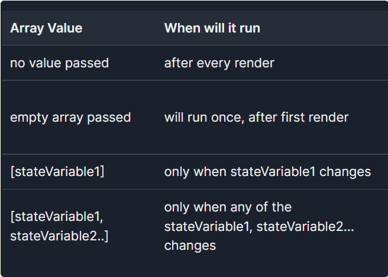

## useEffect

useState是用来在函数式组件中添加状态，而useEffect是用来处理函数组件中的副作用的。而react希望我们尽量把函数组件写成纯函数。

先说纯函数：既：固定的输入，会得到固定的输出。

```js
function myPureFunction(count) {
  return count + 1;
}
```

react推荐函数式组件：

```js
/** 纯函数示例 */
fucntion App({num}){
  return <p>我们有{num}个前端程序员</p>
}
```

但是在实际开发过程中，我们的函数组件会有大量的逻辑操作到函数以外的东西，使函数变的不纯，这些操作就叫副作用。

> 从 API 获取数据、与数据库通信以及将日志发送到日志服务等，任何可能导致相同的输入会出现不同的输出的操作，都被认为是副作用。

而`useEffect`就是用来集中处理这些副作用的地方。

```js
fucntion App({num}){
  useEffect(()=>{
    // todo....  
  })

  return <p>我们有{num}个前端程序员</p>
}
```

useEffect的函数签名如下：

```js
function useEffect(effect: EffectCallback, deps?: DependencyList): void;

type EffectCallback = () => (void | Destructor);
```

**重点：**

学习`function component`、学习`hooks`，一定要忘记`class component`中的知识，二者毫无关联性，一切强行去关联生命周期等概念的观点，都是错误的！

> 国内之所以流行关联生命周期的概念，主要是因为react官网中使用`class Component`做了比较。

思维模型：**UI=Fn(state)**

## useEffect返回函数, 依赖项数组

返回函数：组件卸载时会被调用，所以所有在useEffect中定义的定时器，监听，订阅等，都需要在返回函数中做相应的取消操作。

依赖项数组：当依赖项改变时，就会触发这个useEffect的调用。`[]`代表不参与任何**react的数据流**

```js
  useEffect(()=>{
    let timer = setTimeout(()=>{

    },1000)
    return ()=>{
      clearTimeout(timer)
    }
  },[])
```



**不要欺骗react**
```js
  useEffect(() => {
    const id = setInterval(() => {
      setCount(count + 1);
    }, 1000);
    return () => clearInterval(id);
  }, []);
```

上述代码中，我们useEffect内部使用了count，但是没有添加进依赖项中，这导致只会被执行一次。这就是我们在欺骗react。关于这件事情：

Dan的教程是这么说：We lied to React by saying our effect doesn’t depend on a value from inside our component, when in fact it does!Our effect uses count — a value inside the component (but outside the effect).

> 我们欺骗react说我们的effect不依赖组件内部的值，但事实上我们使用了`count`。

Therefore, specifying `[]` as a dependency will create a bug. React will compare the dependencies, and skip updating this effect. Dependencies are equal, so we skip the effect.

> 因此，指定`[]`为依赖项会产生错误。React将比较依赖关系，因为依赖是相等的，所以跳过更新此effect。

Therefore, I encourage you to adopt it as a hard rule to always be honest about the effect dependencies, and specify them all. 

> 因此，我鼓励您将其作为一项硬性规则，始终对effect依赖项保持诚实，并指定它们。


国内的教程通常是这么说的：useEffect依赖谁，就把谁加到依赖项数组中。


所以，建议大家看文档学习，还是还看一手资料。
  1. 二手资料通常都是加工、省略过的，准确度有问题
  2. 二手资料在编写时面向的对象不一定是我们当前所处的阶段
  3. 二手资料具有时效性，原文进行修正更新后，二手不会同步


## useEffect的执行流程

```js
function App() {
  const [counter, setCounter] = useState(0)
  useEffect(() => {
    console.log('from useEffect...', counter)
  })
  function incrementClickHandler() {
    setCounter(counter + 1)
    console.log("incrementClickHandler.....", counter)
  }

  console.log('before render...', counter)
  return (
    <div className='App'>
      <h1>{counter} </h1>
      <button onClick={incrementClickHandler}>Increment</button>
    </div>
  )
}
```

1. 初次渲染函数输出`before render...0`，useEffect 中的函数将在视图渲染后立即运行,输出`from useEffect...0`
2. 点击按钮：
   1. 点击事件触发incrementClickHandler 函数，输出`incrementClickHandler.....0`
   2. 由于函数内部触发了`setCounter`，导致APP重新渲染，输出`before render...1`
   3. 此时`useEffect`不会被执行,视图将被渲染，增量按钮上方的数字将从 0 变为 1。
   4. 视图渲染之后，`useEffect`运行,输出`from useEffect...1`

Q: 为什么useEffect要在渲染之后执行？

A: 因为用户只关心视图，他不关心我们的`console.log`或`localStorage`（或任何其他与此相关的副作用），这就是为什么react在更改状态后立即反映状态的原因。如果在状态变化和渲染（视图）之间有一些过程，那么这个过程总是会减慢渲染速度并降低用户体验。

Q: A路由跳转B路由时，先执行A路由的挂载还是B路由的卸载?


## 关于useEffect中调用异步函数问题

```js
function Counter() {
  const [count, setCount] = useState(0);
  useEffect(async () => {
    const c = await new Promise(res => {
      setTimeout(() => {
        res(2)
      }, 1000)
    })
    console.log(c)
    setCount(8)
  }, [])
  return <h1>{count}</h1>;
}
```

首先说一下useEffect不支持async回调函数，是因为react规定useEffect必须返回一个普通函数。所以上面这段代码是不对的。

但是，这段代码并不会报错，仅是eslint的警告而已。**千万不要在项目中这么使用**。


还有些人会说useEffect中调用异步函数，使用自执行函数。就像这样：
```js
  useEffect(() => {
    (async function d() {
      await new Promise(res => {
        setTimeout(() => {
          st(num => num + 1)
          res()
        }, 2000)
      })
    }
    )();
  }, [])
```

垃圾代码，花里胡哨，花样百出

**踏踏实实用`异步调用`、`.then`去解决问题。**

```js
function Counter() {
  const [count, setCount] = useState(0);
  useEffect(()=>{
    async function getData() {
      return new Promise(res => {
        setTimeout(() => {
          res(2)
        }, 1000)
      })
    }
    getData().then(res=>{
      setCount(res)
    })
  }, [])
  return <h1>{count}</h1>;
}
```

## 依赖报警问题与解决方案

以下几种情形会被react内置的eslint规则提出警告:`React Hook useEffect has a missing dependency: ''. Either include it or remove the dependency array`，而通常我们解决方案都是从思考**此处使用state的原因是什么？**开始：

1. 当开发者想仅使用一次state, 不希望后续state改变的时候触发effect，于是effect的依赖项中就没有添加state
```js
  let [state] = useState("")
  useEffect(() => {
    console.log(state)
  }, [])
```

解决方案: 使用state用来做什么？
  
* 用来做网络请求，赋值一类的操作？直接使用初始化的值
```js
  let [state,setState] = useState('')
  useEffect(() => {
    let initState = ""
    setState(initState)
    request({
      data: initState
    })
  }, [])
```
* 用来求值一类的操作？直接在函数组件中定义即可，不需要使用state
```js
  let [state] = useState(100)
  let value = state / 2
  // todo...
```
  // !2. 如果网络请求使用props的参数，那就不存在这个问题，因为props改变必然会重新渲染。

2. 组件`effect`依赖多个状态，但是某个状态变更时不希望执行`effect`

场景：页面中有筛选条件+开始按钮，筛选条件单独修改时不触发`effect`，点击开始按钮的时候触发`effect`，并且使用筛选条件。

```js
  let [type] = useState("")
  let [searchKey] = useState("")
  let [buttonState] = useState("")
  useEffect(() => {
    if(buttonState === 'start'){
      console.log(state1, state2)
    }
  }, [type,searchKey,buttonState])
```

解决方案：不应该使用effect
```js
  let [type] = useState("")
  let [searchKey] = useState("")

  // 某按钮触发此函数
  function startAction(){
    console.log(state1, state2)
  }

  // todo...
```

3. 用到了一些第三方的hooks，不添加依赖就会提示警告
  
例如：此处我们认为location不会改变
```js
  let location = useLocation()
  useEffect(() => {
    console.log(location)
  }, [])
```
解决方案：按照提示把location加入到依赖中就可以了，因为location不会变的
```js
  let location = useLocation()
  useEffect(() => {
    console.log(location)
  }, [location])
```

4. props改变, 某个effect中使用了props参数和某状态

与第一点的差距是这里有其他依赖项

```js
  let [state3] = useState("")
  useEffect(() => {
    console.log(props.a, state3)
  }, [props.a])
``` 
解决方案：直接使用初始值。此处使用到的不应该是state。

```js
  let [state,setState] = useState('')
  useEffect(() => {
    let initState = ""
    setState(initState)
    request({ // 模拟网络请求
      data: initState,
      xxx: props.a
    })
  }, [props.a])
```

5. useEffect死循环

场景：分页加载数据时，第二页数据需要跟第一页数据拼接在一起，此时又不能把数据状态写进依赖中，否则就会死循环。
```js
  let [schoolList,setSchoolList] = useState([])
  useEffect(() => {
    setTimeout(() => { // 模拟网络请求
      let res = {
        data: [1, 2, 3, 4]
      }
      setSchoolList(schoolList.concat(res.data))
    },1000)
  }, [])
```

解决方案：使用setState的函数式赋值方式

```js
  let [schoolList,setSchoolList] = useState([])
  useEffect(() => {
    setTimeout(() => { // 模拟网络请求
      let res = {
        data: [1, 2, 3, 4]
      }
      setSchoolList(schoolList => {
        schoolList.push(...res.data)
        return schoolList
      })
    },1000)
  }, [])
```

你要按照上面那么写,页面是不会渲染的...

```js
let [schoolList,setSchoolList] = useState([])
  useEffect(() => {
    setTimeout(() => { // 模拟网络请求
      let res = {
        data: [1, 2, 3, 4]
      }
      setSchoolList(schoolList=>[...schoolList,...res.data])  
    },1000)
  }, [])

```

> useReducer也可以用来绕过依赖项检查，useReducer也被称为hooks的作弊模式。不过没必要的话还是少用吧

### useEffect批处理的bug

useEffect仅对react事件进行批处理操作。v18之后修改了这个问题。

```js
  let [text, setText] = useState({})
  let [text1, setText1] = useState({})

  useEffect(() => {
    console.log(text, text1)
    console.log("触发网络请求")
  }, [text, text1])

  useEffect(() => {
    console.log('批处理')
    setText({ a: "1" })
    setText1({ f: 2 })
  }, [])
  useEffect(() => {
    console.log('非批处理')
    setTimeout(() => {
      setText({ a: "1" })
      setText1({ f: 2 })
    }, 1000)
  }, [])
```


### useLayoutEffect

其函数签名与 useEffect 相同，但它会在所有的 DOM 变更之后同步调用 effect。会造成阻塞视觉更新

## Race condition

```js
let num = 2

setTimeout(()=>{
  num = num * 2
},Math.random()*1000)

setTimeout(()=>{
  num = num + 20
},Math.random()*1000)

setTimeout(()=>{
  console.log(num) // => 输出num是多少??
},1000)

```

示例代码如下：快速的点击会造成竞态的bug,最终的UI并非正确显示的UI

```js
import React, { useEffect, useState } from "react";

export default function App() {
  const [currentId, setCurrentId] = useState(1);

  const handleClick = () => {
    const idToFetch = Math.round(Math.random() * 80);
    console.log(idToFetch, 'xx')
    setCurrentId(idToFetch);
  };

  return (
    <React.Fragment>
      <div>
        <p>Requesting ID: {currentId}</p>
        <button type="button" onClick={handleClick}>
          Fetch data!
        </button>
      </div>
      <hr />
      <DataDisplayer id={currentId} />
    </React.Fragment>
  );
}

function DataDisplayer(props) {
  const [data, setData] = useState(null);
  const [fetchedId, setFetchedId] = useState(null);

  useEffect(() => {
    // let active = true;
    const fetchData = async () => {
      setTimeout(async () => {
        const response = await fetch(
          `https://swapi.dev/api/people/${props.id}/`
        );
        const newData = await response.json();
        // if (active) {
        setFetchedId(props.id);
        console.log(props.id)
        setData(newData);
        // }
      }, Math.round(Math.random() * 1000));
    };

    fetchData();
    // return () => {
    //   active = false;
    // };
  }, [props.id]);

  if (data) {
    return (
      <div>
        <p style={{ color: fetchedId === props.id ? "green" : "red" }}>
          Displaying Data for: {fetchedId}
        </p>
        <p>{data.name}</p>
      </div>
    );
  } else {
    return null;
  }
}

```

为什么会发生这种情况？

多个请求被并行触发（竞争渲染相同的视图），我们只是假设最后一个请求将最后解决。实际上，最后一个请求可能首先解决，或者只是失败，导致第一个请求最后解决。

竞争条件：最终的结果取决于程序的精准时序。

解决方案，通常为忽略请求的结果和取消请求的方式。例如上述示例代码中注释的代码就是材取的忽略结果的方式。
