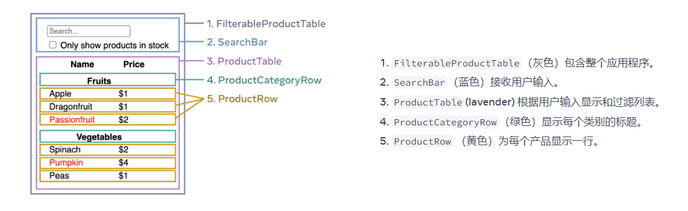

## react组件化

> 这个组件化划分的方式是根据我的经验以及我的知识体系总结出的结论，并非组件化铁律。

首先排除一个误区：组件分类曾经被普遍分为：展示组件，容器组件。 国内也提出过智能组件，木偶组件其实是一样的东西，换了个名字而已

展示组件，容器组件的来源由dan在2015年发布的一篇博客中提出的这两个概念。但是到了2019年，他自己本身也认为这两个概念是错误的，这样划分组件是不对的。主要是因为hooks的出现完全改变了react的生态，也完全改变了react的写法。

所以，如果知道展示组件，容器组件的概念，现在就可以忘记它了。

## 搭积木

  大家都玩过积木吧，积木并不是全部的零件都是最小的。它还会有各种较大的，较为完整的积木。
    

  我们组件化划分原则就像搭积木，并不是一味的切分为最小单元就是最好的，我们也要适当的保留一些大块的组件，就像搭积木一样，当我们需要的时候，一块完整的积木会带来极大的方便。

  那么如何划分组件才是合理的呢？

  我认为：应该按照**组件功能**（非产品逻辑功能）+ **最小复用**的方式来划分

  首先解释一下此处的产品逻辑功能和组件功能的区别：

  例如我们现在有一个弹窗组件，产品会要求有很多个种类的弹窗，双按钮的弹窗，关闭的弹窗，无边框的弹窗等等等。这些各种弹窗就是产品逻辑功能，而我们的组件功能，仅仅只是**弹窗**。

  **此处插播一条单一职责原则**
  按照单一职责原则我们应该是**一个组件对一组相同功能负责**，例如搜索相关的一组功能。弹窗相关的一组功能。
  
  而不是一个组件对一个功能负责，就像a模式搜索一个组件，b模式搜索一个组件，c模式搜索一个组件。


  所以，我们需要写一个**弹窗组件**，那如何完成产品逻辑功能呢？这就要使用**最小复用**了。

  最小复用：一定范围内，只要功能被复用到了，就拆分成单独组件，而没有复用的功能就不进行拆分。示例代码如下：
  
  ```js
    function A(){
      return (
        <div>
          A组件单独的逻辑
          <Search />
          A组件中有一个输入框
          <input>
        <div>
      )
    }
    function B(){
      return (
        <div>
          B组件单独的逻辑
          <Search />
          B组件中有一个列表
          <ul>
            <li>1</li>
            <li>2</li>
            <li>3</li>
            <li>4</li>
          </ul>
          <Search />
        <div>
      )
    }
    // 公共的Search组件
    function Search(){
      return (
        <div>
          这个是搜索组件
        <div>
      )
    }
  ```

## 实现搜索功能组件

在了解了**组件功能**和**最小复用**之后，我们实现一个搜索功能的组件划分：

首先我们假定本次需要实现单按钮模式，双按钮模式，右上角关闭模式, 无边框模式。


## 官方示例解读

  在 [thinking in react](https://beta.reactjs.org/learn/thinking-in-react) 中, 有这样一个示例：

    


  我们使用**组件功能**和**最小复用**来解读一下这个示例：

  * 灰色：整个页面的盒子，没啥好说的
  * 蓝色：头部的搜送功能组件，他还有最小复用组件么？没有了，所以他是单独的一个组件
  * 紫色：功能未渲染列表，其中表头 `Name`、`price`有复用么？没有，所以它不需要抽成组件。
  * 绿色、黄色：列表功能组件中的子组件，因为他们都是复用的所以他们被抽成了单独的组件。

  那么为什么列表中的内容区域`Apple`没有被抽成更小的组件呢？
  
  因为他们是共同组成了一个列表的行(黄色组件)，而并没有被拿到其他地方作为复用。所以`行`就是我们生成的最小的组件划分了。

## 补充

当我们需要处理性能问题时，我依然推荐更细粒度的组件划分方式

纯组件更有利于组件的复用