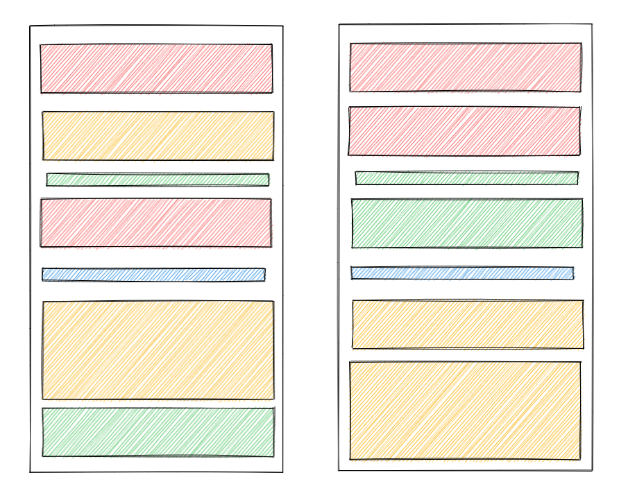
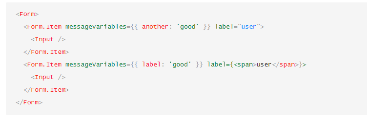
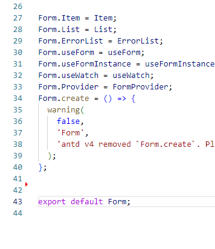

## react组件化

首先排除一个误区：组件分类曾经被普遍分为：展示组件，容器组件。 国内也提出过智能组件，木偶组件，其实都是一样的东西，换了个名字而已

展示组件，容器组件的来源由dan在2015年发布的一篇博客中提出的这两个概念。但是到了2019年，他自己本身也认为这两个概念是错误的，这样划分组件是不对的。主要是因为hooks的出现完全改变了react的生态，也完全改变了react的写法。

所以，如果知道展示组件，容器组件的概念，现在就可以忘记它了。

## 关注点分离原则

物以类聚，把相关联的逻辑都放到一个组件。

[尤雨溪在issue中的回答](https://github.com/vuejs/rfcs/issues/55)



## 最小知识原则

每个组件不该知道的不要知道。

```js

function A(){
  let num = 2
  return <B num={num}/>
}

function B({num}){
  return <C num={num} />
}

function C({num}){
  return <div>{num}</div>
}

```

## 单一职责原则

一个模块对**一组**相同功能负责，注意是一组功能，而不是一个模块对一个功能负责。例如下文中我们提到的弹窗组件

## 受控组件、非受控组件 - 表单

* [受控组件文档](https://reactjs.org/docs/forms.html#controlled-components)

* [非受控组件文档](https://reactjs.org/docs/uncontrolled-components.html)

有时一个组件的输入完全依赖于属性，这样的组件内部没有状态，完全受到外部的控制，这样的组件是受控组件。 
> 受控组件的优势是设计简单，缺点是增加了更新路径的长度（最小知识原则）。 

非受控组件内部维护了状态，因此外部只需要传入初始值，这样就不需要利用外部属性来驱动组件更新。

react推荐优先使用受控组建
  - 拥有方便的数据流

尽量优先考虑非受控组件
  - 最小知识原则（组件状态 !== 表单数据，每个组件只知道自己需要知道的数据即可）
  - 最小交互原则（减少数据流）
  - 单一职责原则（让组件自己承担完自己应该承担的部分）
  - 性能考虑（受控组件一直向外抛数据驱动单项数据流一直运行，如果牵扯的组件多了，性能就会有问题）
  - 代码量更少

> 最佳实践：一般大型组件库，都会同时实现受控与非受控两种方式。

## 搭积木

  React组件化其实就是搭积木，这里要注意的是，积木并不是全部的零件都是最小的。它还是会有各种较大的，较为完整的积木。
    

  我们组件化划分原则就像搭积木，并不是一味的切分为最小单元就是最好的，我们也要适当的保留一些大块的组件，就像搭积木一样，当我们需要的时候，一块完整的积木会带来极大的方便。

  那么如何划分组件才是合理的呢？

  目前来看，应该按照**模块功能**（非产品逻辑功能）+ **最小复用**的方式来划分

  首先解释一下此处的**模块功能**和**产品逻辑功能**的区别：

  假设我们现在有一个弹窗组件，产品会要求有很多个种类的弹窗，双按钮的弹窗，关闭的弹窗，无边框的弹窗等等等。这些各种弹窗就是产品逻辑功能，而我们的模块功能，仅仅只是**弹窗**。

  我们有了功能组件之后，那如何完成产品逻辑功能呢？这就要使用**最小复用**了。

  最小复用：一定范围内，只要功能被复用到了，就可以考虑拆分成单独组件，而没有复用的功能就不进行拆分。示例代码如下：
  
  ```js
    function A(){
      return (
        <div>
          A组件单独的逻辑
          <Search />
          A组件中有一个输入框
          <input>
        <div>
      )
    }
    function B(){
      return (
        <div>
          B组件单独的逻辑
          <Search />
          B组件中有一个列表
          <ul>
            <li>1</li>
            <li>2</li>
            <li>3</li>
            <li>4</li>
          </ul>
          <Search />
        <div>
      )
    }
    // 公共的Search组件
    function Search(){
      return (
        <div>
          这个是搜索组件
        <div>
      )
    }
  ```

## 官方示例解读

  在 [thinking in react](https://beta.reactjs.org/learn/thinking-in-react) 中, 有这样一个示例：

    


  我们使用**模块功能**和**最小复用**来解读一下这个示例：

  * 灰色：整个页面的盒子，没啥好说的
  * 蓝色：头部的搜送功能组件，他还有最小复用组件么？没有了，所以他是单独的一个功能组件
  * 紫色：功能为渲染列表，其中表头 `Name`、`price`有复用么？没有，所以它也是单独的一个功能组件
  * 绿色、黄色：列表功能组件中的子组件，因为他们都是复用的所以他们被抽成了单独的组件。

  那么为什么列表中的内容区域`Apple`没有被抽成更小的组件呢？
  
  因为他们是共同组成了一个列表的行(黄色组件)，而并没有被拿到其他地方作为复用。所以`行`就是我们生成的最小的组件划分了。

## 代码示例

```js
import { useState } from 'react';

function FilterableProductTable({ products }) {
  const [filterText, setFilterText] = useState('');
  const [inStockOnly, setInStockOnly] = useState(false);

  return (
    <div>
      <SearchBar 
        filterText={filterText} 
        inStockOnly={inStockOnly} 
        onFilterTextChange={setFilterText} 
        onInStockOnlyChange={setInStockOnly} />
      <ProductTable 
        products={products} 
        filterText={filterText}
        inStockOnly={inStockOnly} />
    </div>
  );
}

// 搜索组件
function SearchBar({
  filterText,
  inStockOnly,
  onFilterTextChange,
  onInStockOnlyChange
}) {
  return (
    <form>
      <input 
        type="text" 
        value={filterText} placeholder="Search..." 
        onChange={(e) => onFilterTextChange(e.target.value)} />
      <label>
        <input 
          type="checkbox" 
          checked={inStockOnly} 
          onChange={(e) => onInStockOnlyChange(e.target.checked)} />
        {' '}
        Only show products in stock
      </label>
    </form>
  );
}

// 表格组件
function ProductTable({ products, filterText, inStockOnly }) {
  const rows = [];
  let lastCategory = null;

  products.forEach((product) => {
    if (
      product.name.toLowerCase().indexOf(
        filterText.toLowerCase()
      ) === -1
    ) {
      return;
    }
    if (inStockOnly && !product.stocked) {
      return;
    }
    if (product.category !== lastCategory) {
      rows.push(
        <ProductCategoryRow
          category={product.category}
          key={product.category} />
      );
    }
    rows.push(
      <ProductRow
        product={product}
        key={product.name} />
    );
    lastCategory = product.category;
  });

  return (
    <table>
      <thead>
        <tr>
          <th>Name</th>
          <th>Price</th>
        </tr>
      </thead>
      <tbody>{rows}</tbody>
    </table>
  );
}

// 表头
function ProductCategoryRow({ category }) {
  return (
    <tr>
      <th colSpan="2">
        {category}
      </th>
    </tr>
  );
}

// 行
function ProductRow({ product }) {
  const name = product.stocked ? product.name :
    <span style={{ color: 'red' }}>
      {product.name}
    </span>;

  return (
    <tr>
      <td>{name}</td>
      <td>{product.price}</td>
    </tr>
  );
}

const PRODUCTS = [
  {category: "Fruits", price: "$1", stocked: true, name: "Apple"},
  {category: "Fruits", price: "$1", stocked: true, name: "Dragonfruit"},
  {category: "Fruits", price: "$2", stocked: false, name: "Passionfruit"},
  {category: "Vegetables", price: "$2", stocked: true, name: "Spinach"},
  {category: "Vegetables", price: "$4", stocked: false, name: "Pumpkin"},
  {category: "Vegetables", price: "$1", stocked: true, name: "Peas"}
];

export default function App() {
  return <FilterableProductTable products={PRODUCTS} />;
}

```
## antd对From模块的划分

  

  

## 补充

1. 当我们需要处理性能问题时，依然推荐更细粒度的组件划分方式
2. 纯函数组件更有利于组件的复用
3. 拆分组件可以减小单个组件的体积，降低组件管理难度，但是切忌过度划分组件，过度划分组件会破坏原有组件的完整性，会导致大量的参数传递，带来隐藏bug和性能消耗
4. 组件的可拓展性是我们在拆分组件时要更多考虑的问题，尤其是拆分公共组件时，可扩展性较差时，不进行组件的拆分
5. 为了视觉效果而拆分组件是优先级最低的拆分组件理由
6. 一个优秀的画家知道何时停止绘画，React的组件化亦然。
