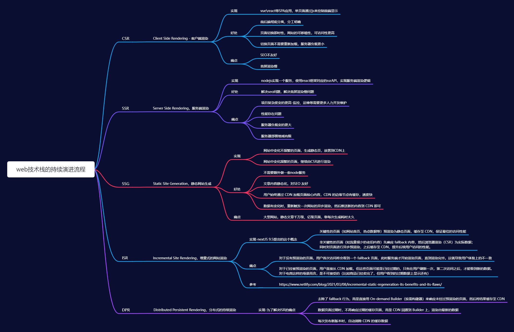

## 关于前端CSR、SSR、SSG、ISR、DPR

## CSR Client Side Rendering - 客户端渲染

**实现**

目前我们利用vue \ react等框架构建单页面（SPA）应用，

单页面是指应用只有一个index.html文件。不同的路由页面都是通过js来控制前端的显示

**好处**

* 前后端彻底分离，分工明确

* 页面切换即时性，网站的可移植性，可访问性更高

* 切换页面不需要重新加载，服务器负载更小

* 整站可以直接上CDN

**痛点**

* SEO不友好，选择了CSR基本就等于放弃了SEO。

* 首屏渲染慢，因为是需要JS来控制页面的渲染，所以渲染部分被放到了js的后面，因此会出现相对较长的白屏。

## SSR Server Side Rendering，服务端渲染

**实现**

服务端渲染页面，主流的前端框架目前都是支持SSR的，以react为例，可以直接使用nextJS框架方便的实现SSR.

> SSR通常是由服务端渲染一个同构的页面到前端，然后前端通过水合把事件跟dom结合来实现。

**好处**

解决seo问题 \ 解决首屏渲染慢问题

**痛点**

* 项目复杂度变的更高-监控、运维等需要更多人力开发维护

* 性能存在问题

* 服务器负载变的更大

* 服务器部署地域有限

## SSG Static Site Generation，静态网站生成

**实现**

静态网站生成，SSR和CSR的一个折中方案

* 网站中变化不频繁的页面，生成静态页，放置到CDN上

* 网站中变化频繁的页面，继续由CSR进行渲染

**好处**

* 不需要额外做一套node服务

* 文章内容静态化，对SEO 友好

* 用户始终通过 CDN 加载页面核心内容，CDN 的边缘节点有缓存，速度快

* 数据有变化时，重新触发一次网站的异步渲染，然后推送新的内容到 CDN 即可

**痛点**

* 大型网站，静态文章千万级、亿级页面，靠每次生成耗时太久

## ISR Incremental Site Rendering，增量式的网站渲染

**实现** nextJS 9.5提出的这个概念

解决SSG的痛点，文章每次生成过于耗时，那么就选择增量生成

关键性的页面（如网站首页、热点数据等）预渲染为静态页面，缓存至 CDN，保证最佳的访问性能

非关键性的页面（如流量很少的老旧内容）先响应 fallback 内容，然后浏览器渲染（CSR）为实际数据；

同时对页面进行异步预渲染，之后缓存至 CDN，提升后续用户访问的性能。

**痛点**

对于没有预渲染的页面，用户首次访问将会看到一个 fallback 页面，此时服务端才开始渲染页面，直到渲染完毕。这就导致用户体验上的不一致

对于已经被预渲染的页面，用户直接从 CDN 加载，但这些页面可能是已经过期的，只有在用户刷新一次，第二次访问之后，才能看到新的数据。对于电商这样
的场景而言，是不可接受的（比如商品已经卖完了，但用户看到的过期数据上显示还有）

**参考**

https://www.netlify.com/blog/2021/03/08/incremental-static-regeneration-its-benefits-and-its-flaws/

## DPR Distributed Persistent Rendering，分布式的持续渲染

**实现** 

为了解决ISR的痛点,去除了 fallback 行为，而是直接用 On-demand Builder（按需构建器）来响应未经过预渲染的页面，然后将结果缓存至 CDN
数据页面过期时，不再响应过期的缓存页面，而是 CDN 回源到 Builder 上，渲染出最新的数据
每次发布新版本时，自动清除 CDN 的缓存数据
