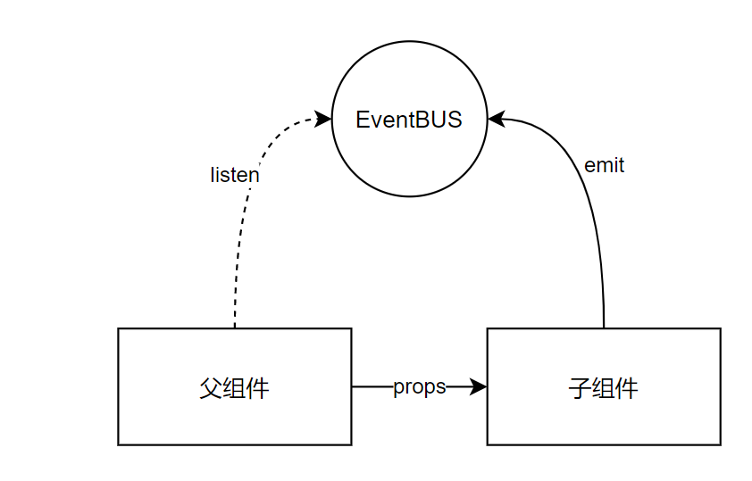

## 前端设计模式

设计模式的意图大于结构，非标准结构实现满足设计模式的意图也是设计模式的实现

**什么是设计模式？**

设计模式是解决方案， 是对软件设计方案中普遍存在的问题提出的解决方案。 

**算法**是不是设计模式？ ——算法解决的是计算问题，不是解决设计上的问题。设计模式通常讨论的是对象间的关系、程序的组织形式等等设计问题。

**面向对象**是不是设计模式？——面向对象是设计模式。

**函数式编程**是不是设计模式？ ——函数式编程是设计模式。

但面向对象和函数式概念包括的范围太大，不太适合做太具体的设计模式探讨。或者说，OOP和FP是两类设计模式的集合，是编程范式。

**什么是前端设计模式？** 

对前端普遍问题的解法。 

前端中会用到传统的设计模式：

- 工厂(Factory)
- 单例(Singleton)
- 观察者(Observer)
- 构造器(Builder)
- 代理模式(Proxy)
- 外观模式(Facade)
- 适配器（Adapter）
- 装饰器（Decorator)
- 迭代器（Generator）

还有一些更偏前端的：

- 组件化（Component） 
- Restful
- 单向数据流
- Immutable
- 插件
- DSL（元数据）

### 单例(singleton)

> 意图是确保一个类只有一个实例。

隐含单例的逻辑。

```tsx
const editor = useContext(RenderContext)
```

设计模式关注的是**设计目标**，并不是对设计实现的**强制约束**。 闭包也可以实现单例，例如：
> 闭包作用域中始终保留了obj实例，所以signleton无论在哪里调用obj都是同一个示例
```tsx
const signleton = () => {
    const obj = new ...
    return () => {
        ...
    }
}
```

单例总结：

- 可以用于配置类、组件上下文中共用的类等
- 用于对繁重资源的管理（例如数据库连接池）


### 工厂(Factory)

> 意图是 将类型的构造函数隐藏在创建类型的方法之下。

举例：`React.createElement` 

适用场景：

- 隐藏被创建的类型
- 构造函数较复杂
- 构造函数较多

###  观察者(Observer)

> 意图是 对象状态改变时通知其他对象。

举例： 观察者( Emitter )

举例：redux/vuex

场景：

- 实现发布、订阅之间1对多的消息通知
- 实现Reactive Programming

> 如果所有的对象与其他对象的交互方式，都是观察者模式，那么我们就完成了一套响应式的程序, 与之对应的则是命令式程序

### 构造器(Builder)

> 意图是将类型的创建构成，抽象成各个部分。

### 代理模式（Proxy）

> 意图是想在原有的类型上增加一些功能和变通处理，但是又不希望用户意识到

将代理类作为原类的接口。通常代理类会在原类型的基础上做一些特别的事情。

什么时候用代理？—— **你想在原有的类型上增加一些功能和变通处理，但是又不希望用户意识到时。**


### 适配器模式(Adapter)\包装模式(wrapper)

> 意图是通过一层包装，让接口不同的类型拥有相同的用法。因此也称为包装模式(wrapper)。抹平不同类型的差异

举例1：react中的事件系统

**重点：抹平差异**

###  外观模式(Facade)

> 对外开箱即用的模式，意图是为了隐藏背后的复杂性

将多个复杂的功能隐藏在统一的调用接口中。

总结：

- 整合资源
- 减低使用复杂度（开箱即用）

### 状态机(StateMachine)

> 意图是 将行为绑定在对象内部状态变化之上。

场景：

- 组织/管理交互设计
- 在DOM之上抽象用户交互

### 装饰器(Decorator)

> 意图为 在不改变对象、函数结构的情况下为它添加功能或说明。
> 跟代理模式很像

装饰器不是AOP，AOP是装饰器

### 迭代器(Iterator/Generator)

用Iterator来遍历容器内的元素（隐藏容器内部数据结构）。javascript的容器: Set, Array, Map等都是迭代器的实现

### 组件化

用组件来**搭建**界面，组件是最小的界面元素。

按照最新的前端对组件理解，在组件化当中，一个组件包括：

- 视图(View)
- 数据(Data) props, state
- 视图到数据的映射（view = f (data) )
- 组件的作用(effect)：根据数据渲染视图(view = f (data ) ) 之外的程序。

组件可以被：

- 映射、变换 
  - view = f(data)
  - view = f·g(data)
  - view = data => data.map(...).map(...).filter(...)……
- 组合（Composition）
- 记忆（Memorization)
  - 记忆是一种作用
  - 参考useMemo
- 列表（List）

组件有这些性质：

- 密封性（sealed)

  - 组件专注、完整
  - 举例：skedo draggable

- 可预测性

  - view = f(data) with effects(...)

- 连续性（continuations)

  - 参考 a + b + c + d = a + ( b + c + d)

    如果：组件的渲染的先后顺序不影响组件渲染的结果。

    ——组件和并发渲染

    ——组件可以和控制流(if/while/for等)无缝结合

  - 每个组件是一个函数调用，是一个任务，它们没有**特殊性**。参考React Fiber

    

  - 每个组件的渲染是一次函数的执行，可以和if/else/while/do/for等等无缝结合


#### 组件的粒度

组件应该具有最小粒度。最小可用原则。

##  思从深，行从简

kiss 不是让程序代码里更少或者使用更简单的编程方式，而是让程序的实现使用最优解的情况下保持最简单。 
dry 不是不让重复代码，而是SPOT，在修改时只修改一处代码
yagin 不是简单的不要过度设计，而是要思考过后保留程序扩展点，同时不要编写不需要的代码

**总之，思从深，行从简。理解设计模式，灵活使用设计模式**

### 单向数据流

传递数据的通道总是单向的，为每个方向的数据传递建立一个单向的通道。

单向数据流的本质其实就是遵循**单向依赖原则**，在程序设计中，我们应当避免**双向依赖**的设计

例如：如一个父组件有两个子组件，分别为A和B。父组件向子组件传递数据，两个组件都接收到了父组件传递过来的数据，在组件A中修改父组件传递过来的数据，子组件B和父组件的值不会发生变化。这就是单向的数据流，子组件不能直接改变父组件的状态。但是如果父组件改变相应的数据，两个子组件的数据也会发生相应的改变。

> emiter - 使用事件可以创建公共依赖，更加进一步解耦单向数据流，从组件间单向数据流，解耦成组件间公共依赖

* vue中的双向数据绑定也是由单项数据流实现的，ViewModel层就是公共依赖

例如（父组件到子组件的传参）


如果子组件要想回传数据到父组件，就需要使用公共的事件：



而不会出现子组件直接操作父组件方法的设计：


> 此处如果将父组件的`setState`传给子组件用的话，就造成了耦合，子组件将完全依赖父组件而不可单独使用。

**避免使用双向依赖，同时也可以避免无限循环的场景：**

```tsx
class A {
  this.b.on("X", () => {
      this.emit("Y")
  })
}

class B {
    this.a.on("Y", () => {
        this.emit("X")
    })
}
```


**单向数据流的场景：受控组件和非受控组件**

> 受控、非受控，指的是 是否受react渲染重绘控制 
> - 受控组件：组件的状态都是外部传入，本身是没有状态的，用户修改时必须由事件传给外部，然后由外部刷新数据触发重绘
> - 非受控组件：就是自己有自己的状态，由组件自己控制刷新

下面的示例中受控组件传入了value,那么用户修改value是不会在react数据中生效的，react渲染重绘时，value还是props中的，而不是用户输入的。而非受控组件，就是以用户输入的value为主：

典型的受控组件

```tsx
function Foo(props){    
  return <Input onChange={props.onChange} value={props.value} />
}
```

典型的非受控组件：

```tsx
function Foo(props){    
  const [val, setVal] = useState(props.initialValue)
  
  useEffect(() => {      
    (debounce(() => {
      if(val !== props.initialValue)
        props.onChange(val)  
    }))()
  }, [val])
  return <Input onChange={setVal} value={val} />
}
```

### 密封性和单一职责

为什么Antd中的 Select和Option是分开的？Tab和Panel是分开的？

> 两个职责，不同的职责拆分

```tsx
const Options = Select.Option

const TabPanel = Tab.Panel
```

密封性和单一职责与关注点分离原则及其相近

- 每件事情应该有独立的模块处理
- 每个独立的模块要把事情做好、做完整

### SSOT原则

Single Source of Truth

数据的来源只有1个，真理只有一个。 

关联的原则：最小知识原则。

```tsx
const ProductList = (props) => {// {a,b,c,d}
    const [passProps, setProps] = useState(props)
    
    return <X {...passProps}>
    </X>
}
```

反思： 组件从数据层面也是密封的(sealed)。例如一个订单列表组件应该自己可以完成所有数据的获取，即便为了提升性能数据作为一个整体被服务端返回。

### 最小交互（知识）原则

减少类型间的交互，减少类型之间的耦合。 

### 开闭原则

提升程序的扩展性（比如插件、元数据、DSL等），减少对程序的修改。 

### 领域设计原则

Rule1： 创建属于自己的领域方言，让每个对象拥有贴近场景的具体含义，做到专对象专用。 

Rule2： 用DSL描述你的系统

Rule3：为不同的目标设计Context

Rule4 : 让元数据可以被扩展能力（插件、组件等）使用

### 插件模式

将扩展能力抽象为可以无序执行、各自处理不同问题的一个个插件。

**开闭原则：对修改关闭，对扩展开放。**

举例1： babel插件

举例2：rollup插件

```tsx
export default function myExample () {
  return {
    name: 'my-example', // this name will show up in warnings and errors
    resolveId ( source ) {
      if (source === 'virtual-module') {
        return source; // this signals that rollup should not ask other plugins or check the file system to find this id
      }
      return null; // other ids should be handled as usually
    },
    load ( id ) {
      if (id === 'virtual-module') {
        return 'export default "This is virtual!"'; // the source code for "virtual-module"
      }
      return null; // other ids should be handled as usually
    }
  };
}

// rollup.config.js
import myExample from './rollup-plugin-my-example.js';
export default ({
  input: 'virtual-module', // resolved by our plugin
  plugins: [myExample()],
  output: [{
    file: 'bundle.js',
    format: 'es'
  }]
});
```

举例3：webpack loader

```tsx
import { getOptions } from 'loader-utils';
import { validate } from 'schema-utils';

const schema = {
  type: 'object',
  properties: {
    test: {
      type: 'string',
    },
  },
};

export default function (source) {
  const options = getOptions(this);

  validate(schema, options, {
    name: 'Example Loader',
    baseDataPath: 'options',
  });

  // Apply some transformations to the source...

  return `export default ${JSON.parse(source)}`;
}
Loader Dependencie
```

###  Immutable

immutable.js

不可变数据集合：数据不可以被改变，若改变就创建新的集合。

Immutable是一个高性能的操作，尤其是大数据量的情况下。
原因是Immutable的数据其实存在一个store中，只会变更需要变更的数据
假设百万数据在一个对象中，Immutable的操作是常量，而普通数据操作则是N

immutable 的优势：
* 可以保留历史变更，且体积小，不会占据大量内存
* 速度快（性能好）
* pure没有副作用
