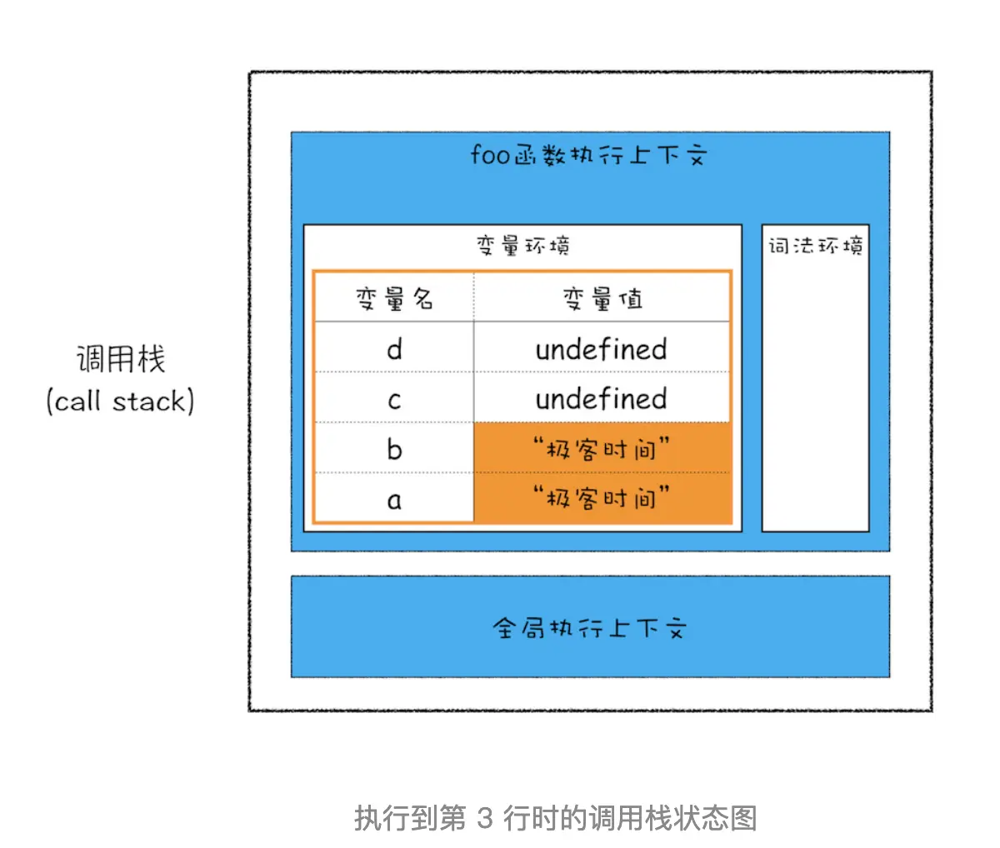
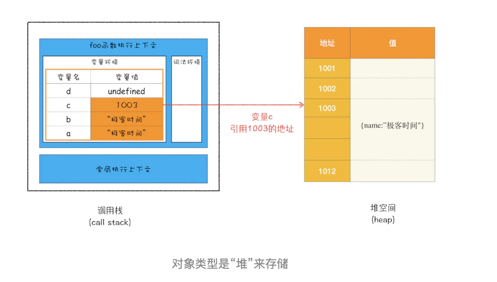
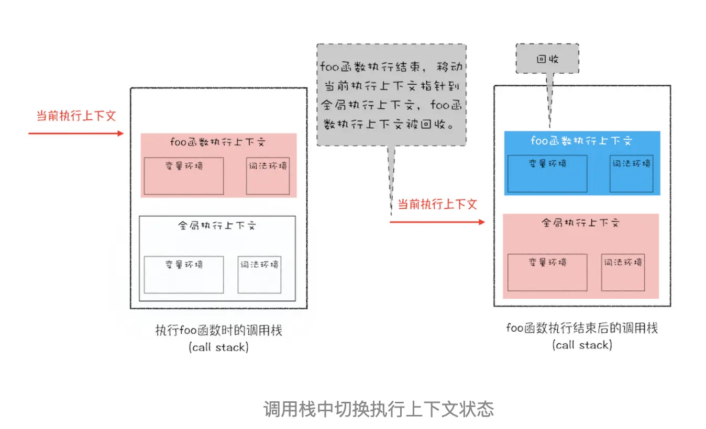

## js的内存空间

在 JavaScript 的执行过程中， 主要有三种类型内存空间，分别是代码空间、栈空间和堆空间。

其中的代码空间主要是存储可执行代码的，栈空间用来管理调用逻辑，堆空间用来在执行过程中管理内存

## 栈空间和堆空间

栈空间就是我们常说的调用栈，是用来存储执行上下文的，先看下面这段代码：
```js
  function foo(){
      var a = "jack ma"
      var b = a
      var c = {name:"jack ma"}
      var d = c
  }
  foo()
```
当执行一段代码时，需要先编译，并创建执行上下文，然后再按照顺序执行代码。下面我们来看看，当执行到第 3 行代码时，其调用栈的状态，参考下面这张调用栈状态图：



从图中可以看出来，当执行到第 3 行时，变量 a 和变量 b 的值都被保存在执行上下文中，而执行上下文又被压入到栈中，所以也可以认为变量 a 和变量 b 的值都是存放在栈中的。

接下来继续执行第 4 行代码，由于 JavaScript 引擎判断右边的值是一个引用类型，这时候处理的情况就不一样了，JavaScript 引擎并不是直接将该对象存放到变量环境中，而是将它分配到堆空间里面，分配后该对象会有一个在“堆”中的地址，然后再将该数据的地址写进 c 的变量值，最终分配好内存的示意图如下所示：




**对象类型是存放在堆空间的**，在栈空间中只是保留了对象的引用地址，当 JavaScript 需要访问该数据的时候，是通过栈中的引用地址来访问的，相当于多了一道转手流程。

原始类型的数据值都是直接保存在“栈”中的，引用类型的值是存放在“堆”中的。那为什么一定要分“堆”和“栈”两个存储空间呢？所有数据直接存放在“栈”中不就可以了吗？

答案是不可以的。这是因为 JavaScript 引擎需要用栈来维护程序执行期间上下文的状态，如果栈空间大了话，所有的数据都存放在栈空间里面，那么会影响到上下文切换的效率，进而又影响到整个程序的执行效率。比如文中的 foo 函数执行结束了，JavaScript 引擎需要离开当前的执行上下文，只需要将指针下移到上个执行上下文的地址就可以了，foo 函数执行上下文栈区空间全部回收，具体过程参考下图：




所以通常情况下，栈空间都不会设置太大，主要用来存放一些原始类型的小数据。而引用类型的数据占用的空间都比较大，所以这一类数据会被存放到堆中，堆空间很大，能存放很多大的数据，不过缺点是分配内存和回收内存都会占用一定的时间。

解释了程序在执行过程中为什么需要堆和栈两种数据结构后，我们还是回到示例代码那里，看看它最后一步将变量 c 赋值给变量 d 是怎么执行的？

在 JavaScript 中，赋值操作和其他语言有很大的不同，原始类型的赋值会完整复制变量值，而引用类型的赋值是复制引用地址。

所以d=c的操作就是把 c 的引用地址赋值给 d，变量 c 和变量 d 都指向了同一个堆中的对象


## 又是闭包
作用域内的原始类型数据会被存储到栈空间，引用类型会被存储到堆空间，基于这两点的认知，探讨下闭包的内存模型。

首先再次看一下闭包的定义：**闭包是在函数声明过程中，将环境信息与所属函数绑定在一起的数据结构。**

```js
function foo() {
    var name = "jack ma"
    let age = 17
    var innerBar = { 
        setName:function(newName){
            name = newName
        },
        setAge:function(newAge){
            age = newAge
        }
    }
    return innerBar
}
foo()
```

* 当 JavaScript 引擎执行到 foo 函数时，首先会编译，并创建一个空执行上下文。

* 在编译过程中，遇到内部函数 setName，JavaScript 引擎还要对内部函数做一次快速的词法扫描，发现该内部函数引用了 foo 函数中的 name 变量，由于是内部函数引用了外部函数的变量，所以 JavaScript 引擎判断这是一个闭包，于是在堆空间创建一个"closure(foo)"的对象（这是一个内部对象，JavaScript 是无法访问的），用来保存 name 变量。

* 接着继续扫描到 setAge 方法时，发现该函数内部还引用变量 age，于是 JavaScript 引擎又将 age 添加到"closure(foo)"对象中。这时候堆中的"closure(foo)"对象中就包含了 name 和 age 两个变量了。

* 此时一个闭包在推空间中形成，环境信息 name 和 age 与函数setName 、setAge分别绑定在一起

## 栈（Stack）与堆（Heap）

栈和堆都是代码在运行时可供使用的内存，但是它们的结构不同。栈以放入值的顺序存储值并以相反顺序取出值。这也被称作 后进先出（last in, first out）。想象一下一叠盘子：当增加更多盘子时，把它们放在盘子堆的顶部，当需要盘子时，也从顶部拿走。不能从中间也不能从底部增加或拿走盘子！增加数据叫做 进栈（pushing onto the stack），而移出数据叫做 出栈（popping off the stack）。

栈中的所有数据都必须占用已知且固定的大小。在编译时大小未知或大小可能变化的数据，要改为存储在堆上。堆是缺乏组织的：当向堆放入数据时，你要请求一定大小的空间。内存分配器（memory allocator）在堆的某处找到一块足够大的空位，把它标记为已使用，并返回一个表示该位置地址的 指针（pointer）。这个过程称作 在堆上分配内存（allocating on the heap），有时简称为 “分配”（allocating）。将数据推入栈中并不被认为是分配。因为指针的大小是已知并且固定的，你可以将指针存储在栈上，不过当需要实际数据时，必须访问指针。

想象一下去餐馆就座吃饭。当进入时，你说明有几个人，餐馆员工会找到一个够大的空桌子并领你们过去。如果有人来迟了，他们也可以通过询问来找到你们坐在哪。

入栈比在堆上分配内存要快，因为（入栈时）分配器无需为存储新数据去搜索内存空间；其位置总是在栈顶。相比之下，在堆上分配内存则需要更多的工作，这是因为分配器必须首先找到一块足够存放数据的内存空间，并接着做一些记录为下一次分配做准备。

访问堆上的数据比访问栈上的数据慢，因为必须通过指针来访问。现代处理器在内存中跳转越少就越快（缓存）。继续类比，假设有一个服务员在餐厅里处理多个桌子的点菜。在一个桌子报完所有菜后再移动到下一个桌子是最有效率的。从桌子 A 听一个菜，接着桌子 B 听一个菜，然后再桌子 A，然后再桌子 B 这样的流程会更加缓慢。出于同样原因，处理器在处理的数据彼此较近的时候（比如在栈上）比较远的时候（比如可能在堆上）能更好的工作。在堆上分配大量的空间也可能消耗时间。

当你的代码调用一个函数时，传递给函数的值（包括可能指向堆上数据的指针）和函数的局部变量被压入栈中。当函数结束时，这些值被移出栈。

跟踪哪部分代码正在使用堆上的哪些数据，最大限度的减少堆上的重复数据的数量，以及清理堆上不再使用的数据确保不会耗尽空间，这些问题正是所有权系统要处理的。一旦理解了所有权，你就不需要经常考虑栈和堆了，不过明白了所有权的存在就是为了管理堆数据，能够帮助解释为什么所有权要以这种方式工作。