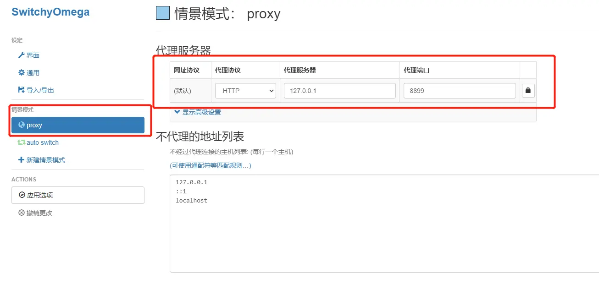

## 简介
whistle(读音 [ˈwɪsəl]，拼音 [wēisǒu] )是基于 Node 实现的跨平台抓包调试代理工具，有以下基本功能：
  * 查看 HTTP、HTTPS、HTTP2、WebSocket、TCP 请求响应数据
  * 修改 HTTP、HTTPS、HTTP2、WebSocket、TCP 请求响应数据
  * 修改请求 url、方法、头部、内容等
  * 修改响应状态码、头部、内容，并支持本地替换等
  * 修改 WebSocket 和 TCP 收发的帧数据
  * 设置 hosts（支持 IPv6）、http-proxy、https-proxy、socks
  * 作为HTTP代理或反向代理
  * 集成常用的 web 调试工具，如 weinre 和 log 等
  * 支持用 Node 编写插件扩展

  **当前版本号2.7.21**

## 安装

  yarn: `yarn add whistle` 

  npm: `npm i whistle -g`

## 基本操作与配套设置

* `w2 start` 启动 `w2 restart` 重启  `w2 stop` 停止服务  `w2 status` whistle当前状态 
  > http://127.0.0.1:8899/ , whistle会启动一个服务，默认8899端口

* chrome下载插件`switchyOmega` 在选项中配置代理，域名`127.0.0.1`,端口`8899`,此时chrome打开的浏览器都会被`whistle`代理请求
	> 右键switchyOmega插件图标，点击选项打开配置页面，配置代理域名`127.0.0.1`,端口`8899`，然后手动切换代理模式

  > switchyOmega图标为黑色代表系统代理，灰色为直连模式，浅蓝色为proxy代理，我们选择浅蓝色的图标即可。**这里不打开代理whistle是不生效的哦**
  
  

* 不下载插件的话，windows系统也可以直接在代理中配置，直接window功能搜索中搜索代理，打开代理功能，开启手动代理，端口设置8899即可

  

* 关于移动端抓包，手机需要跟电脑在同一网段，打开wifi手动配置代理：ip是电脑ip, 端口是8899即可

* 对于开启https的抓包，PC跟移动端都需要下载whistle证书（下载地址看文末），放置到受信任的证书中。
  > 下载证书后，双击证书，根据指引安装证书。证书安装过程，要确保证书存储到**受信任的根证书颁发机构**下。
  > tips: 需要在开启代理的环境中才能下载证书。

* 对于options请求，需要打开浏览器的开发者工具，勾选disable cache,否则options请求只能抓到一次，不能抓到真实请求

## 本地服务配置代理
  本地启动服务(自己本地搭建的express)，打开react项目build后的文件（react中接口请求`example.com`），`example.com`会出现网络请求跨域的问题，可以使用whistle直接配置域名代理即可，流程如下：
  * react项目build
  * 运行自己写的server，打开build后的文件，我是运行在9999端口，`localhost:9999` 此时就接口出现跨域
  * 打开whistle 配置一条Rules: `example.com localhost:9999`，`example.com` 是跨域接口的地址
  * 浏览器打开`example.com` 代理访问 `localhost:9999`，此时没有跨域问题了


## 配置规则

* 本地文件或文件路径替换，协议头可以加也可以不加，不加表示匹配所有协议，否则只对某个协议生效。类似willow的路径替换。

```js
  ctc.i.gtimg.cn/qzone/biz/gdt/atlas/mod/message.html  C:\Users\ouvenzhang\Desktop\edit.html # 单个文件的本地替换
  ctc.i.gtimg.cn/qzone/biz/   C:\Users\ouvenzhang\Desktop\biz\build\  # 文件路径的替换，一般用这条就可以了
  http://ctc.i.gtimg.cn/qzone/biz/ C:\Users\ouvenzhang\Desktop\biz\build\   #只针对http请求的文件路径替换
```

* 请求转发，将指定域名请求转发到另一个域名
```js
  www.qq.com ke.qq.com # 指定域名转发生效
  **.qq.com ke.qq.com  # 所有qq.com子域名转发生效
```

* 脚本注入，可以将一段脚本（可以使html、js、CSS片段）注入到dom页面中进行调试
```js
  ke.qq.com html://E:\xx\test\test.html
  ke.qq.com js://C:\Users\ouvenzhang\Desktop\gdt\console.js
  ke.qq.com css://E:\xx\test\test.css
```

* 匹配模式，可以根据正则式匹配路径
```js
  #/keyword/i #关键字匹配
  /ke\.qq\.com\/atlas\/(\d+)\/order\/edit/i C:\Users\ouvenzhang\Desktop\gdt\edit.html  # 正则匹配
  ke.qq.com/atlas/25610/order/edit C:\Users\ouvenzhang\Desktop\gdt\edit.html    # 直接匹配
```

* 忽略特性的请求内容
```js
  /qq.com/ filter://rule|hide    # 忽略包含qq域名下的请求并不在network中显示
  /spa\-monitor\.min\.js/i filter://rule  # 忽略匹配包含spa-monitor.min.js，但在network中显示，相当于文件白名单
```

* 相同协议规则的默认优先级从上到下，即前面的规则优先级匹配高于后面，如：
```js
  www.test.com 127.0.0.1:9999
  www.test.com/xxx 127.0.0.1:8080
```

请求 https://www.test.com/xxx/index.html 按从上到下的匹配顺序，只会匹配 www.test.com 127.0.0.1:9999，这个与传统的hosts配置后面优先的顺序相反。

> 如果想跟系统hosts匹配顺序一致，可以在界面通过 Rules -> Settings -> Back rules first 修改，但这个规则只对在页面里面配置的规则生效，对插件里面自带的规则及通过@方式内联的远程规则不生效。

* 除rule及proxy对应规则除外，可以同时匹配不同协议的规则

```js
  www.test.com 127.0.0.1:9999/
  www.test.com/xxx 127.0.0.1:8080/
  www.test.com proxy://127.0.0.1:8888
  www.test.com/xxx socks://127.0.0.1:1080
  www.test.com pac://http://www.pac-server.com/test.pac
  www.test.com/xxx http://www.abc.com
  www.test.com file:///User/xxx/test
```

请求 https://www.test.com/xxx/index.html 按从上到下的匹配顺序，及第二点原则，会匹配以下规则：

```js
www.test.com 127.0.0.1:9999/
www.test.com proxy://127.0.0.1:8888
www.test.com pac://http://www.pac-server.com/test.pac
www.test.com/xxx http://www.abc.com
```
> proxy、http-proxy、https-proxy、socks都属于proxy，html、file等都属于rule，所以这两个对应的协议只能各种匹配其中优先级最高的一个。

* 一些属于不同协议，但功能有冲突的规则，如 rule、host、proxy，按常用优先级为 rule > host > proxy


## 过滤条件设置

  * 可用多个条件用空格或换行分割，支持正则，支持以下条件，/^(m|i|h|b|c|d|H):

  * m:pattern：pattern为字符串或正则表达式，匹配请求方法包含该字符串(不区分大小写)或匹配该正则的请求

  * i:ip：ip表示客户端ip或正则表达式，匹配客户端ip包含该字符串(不区分大小写)或匹配该正则的请求

  * h:header：header表示请求头rawData的某部分字符或正则表达式，匹配请求头包含该字符串(不区分大小写)或匹配该正则的请求, 
  > 过滤type字段使用h,例如：h:css 过滤css请求

  * H:host：host表示Network里面的host字段，为请求的域名加端口，匹配请求host字段包含该字符串(不区分大小写)或匹配该正则的请求

  * 其它：正则或普通字符串，匹配请求URL包含该字符串(不区分大小写)或匹配该正则的请求
  > host \ url 字段可以直接使用filter 过滤关键词

  > 可以通过右键 Filter -> This URL 或 This Host 快速过滤当前URL或host的请求

## 更多
  
  * [whistle中文文档](http://wproxy.org/whistle/install.html)
  
  * [whistle证书下载](http://wproxy.org/whistle/webui/https.html)

## 关于chrome的跨域
  
  * 访问 `chrome://flags/#unsafely-treat-insecure-origin-as-secure`
  * 设置为enabled 启用
  * 填入允许跨域的域名，多个域名用逗号分隔
  * chrome是这么教的，但不知道为啥，我改了不好使。。。。