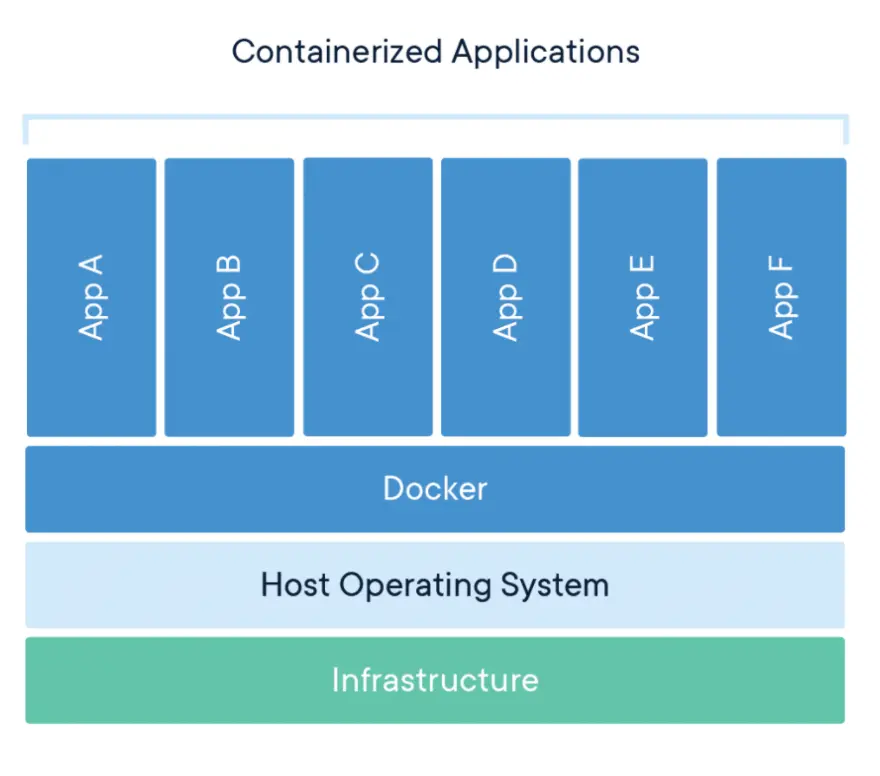

Docker是一种管理应用的现代手段，让应用管理变得可以预测和高效。

简单讲，Docker不隔离计算， 只隔离环境。

## 什么是环境？什么是计算？

环境，就包括文件系统、网络等。

比如Docker容器中的进程，只能看到Docker容器“框”住的资源。比如进程在Docker容器中看到的`/` 目录，实际上可能对应用户本机上的`/var/docker/fs/001` ——这里是个简化的例子。

进程看到的**网络**，也是隔离的网络。执行进程的用户也是Docker容器内部的用户，和外部完全隔离。

但是和虚拟机不同，Docker不隔离计算。Docker容器中的进程，也是真实的进程，不是虚拟的进程。 

当一个Docker容器中的进程写入文件的时候，并不是在一台虚拟机上写，而是在用户本地操作系统的文件系统中写入，只不过被隔离了。

##  Docker是一种隔离技术而非虚拟化

虚拟化技术最明显的特征是执行层面的虚拟化——虚拟CPU指令。比如你本机的Windows不管理vmware中运行的进程，因为vmware中的进程已经完全运行在虚拟化技术上。

Docker将自己直接嫁接在操作系统上，Docker中的进程也是真实的进程，Docker使用的文件系统也是真实的文件系统（只不过做了隔离）。

Docker使用的网络也是真实的网络，只不过做了隔离。（网络本身就是虚拟的概念）

虚拟机架构


Docker的架构



## docker镜像与容器的关系
  镜像是指某个应用的镜像，比如：mysql，node，等
  容器是启动的进程，一个镜像可以启动无数个容器

## 常用命令行

  * `docker help` 帮助文档
  * `docker pull [image]` docker拉取一个镜像
  * `docker images`  docker当前的镜像列表
  * `docker build ` 构建镜像
  * `docker rm [id]` 根据容器id，删除一个容器
  * `docker rmi [id]` 根据镜像id，删除一个镜像
  * `docker run ` docker运行一个容器
  * `docker run -p 8080:80 --name hello -d hello-word` docker启动把本地端口8080映射到容器80端口，启动容器名字叫hello, 镜像名字是
  helloword。-d 是使用后台运行，启动后不会占用窗口
  * `daocker start [容器名字]` 启动一个docker的容器
  * `docker container ls` 查看docker容器列表
  * `docker ps` 查看容器列表
  * `docker ispenct [containerid]` 根据容器id, 查看容器信息
  * `docker exec ` 可进入指定容器的终端


  > build 构建镜像、run 创建容器、 start启动容器


## 修改docker镜像的源
  window `C:\Users\Admin\.docker\config.json` 其中Admin是自己的用户名
  ```
    "registry-mirrors": "你自己的阿里云镜像地址"
  ``` 

## docker - mysql

**拉取mysql: 默认拉取latest版本**
  
  `docker pull mysql` 

**启动新的mysql容器** 
  
  `docker run --name mymysql -e MYSQL_ROOT_PASSWORD=123456 -p 3306:3306 -d mysql:latest`
  * `--name` 名称: mymysql， 
  * `-e` 给容器发送指令MYSQL_ROOT_PASSWORD=123456 ，
  * `-p 3306:3306` 本地3306端口映射到docker的3306端口
  * `-d` 在后台运行，不占用终端，使用mysql:latest镜像

  > mysql:latest版本（8+） 因为加密协议不对，需要改动mysql加密协议，选用mysql:5.7的话就不需要
  
  修改协议的方式如下：
  
  * `docker exec -it mymysql /bin/bash` 进入docker容器终端
  * `mysql -u root -p`  进入mysql的root账户，输入密码，进入到mysql
  * `ALTER USER 'root'@'%' IDENTIFIED WITH mysql_native_password BY '123456';`   root是mysql用户名；%是所有ip，也可以指定x.x.x.x的ip； 123456是密码
  * `ALTER USER 'root'@'%' IDENTIFIED BY '123456' PASSWORD EXPIRE NEVER;`  更新一下用户的密码
  * `FLUSH PRIVILEGES;`  刷新权限

**连接mysql**
  node
  ```js
    var mysql = require('mysql');
    var connection = mysql.createConnection({
      host: '192.168.0.107', // 本机ip
      user: 'root',
      password: '123456',
      database: 'mysql'
    });

    connection.connect();

    connection.query('SELECT * FROM user', function (error, results, fields) {
      if (error) throw error;
      console.log(results);
    });

    connection.end();
  ```
  
**可视化管理mysq**

使用DBeaver

```shell
docker pull dbeaver/cloudbeaver:latest

docker run -d --name cloudbeaver --rm -ti -p 8081:8978 -v /var/cloudbeaver/workspace:/opt/cloudbeaver/workspace dbeaver/cloudbeaver:latest

```
访问localhost:8081即可访问DBeaver，新建数据库链接即可，要注意开启 allowPublicKeyRetrieval 需要开启为true


## 更多 
  * [docker 下载](https://docs.docker.com/get-docker/)
  * [docker 应用镜像下载](https://hub.docker.com/)