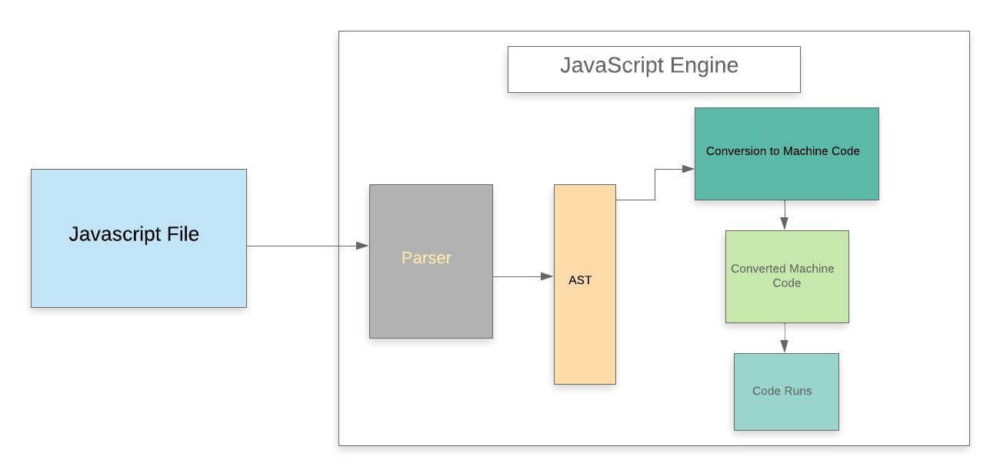
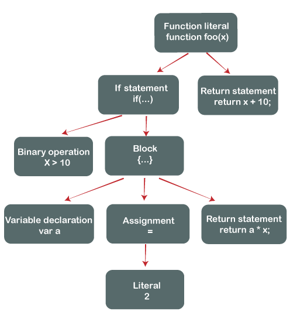

## How does JavaScript Work?

> JavaScript是如何工作的

JavaScript is a client-side scripting language and one of the most efficient, commonly used scripting languages. The term .client-side scripting language means that it runs at the client-side( or on the client machine) inside the web-browsers, but one important thing to remember is that client's web-browser also needs to support the JavaScript or it must be JavaScript enabled. Nowadays, most of the modern web browsers support JavaScript and have their JavaScript engines. For example, Google Chrome has its own JavaScript engine called V8.

> javaScript 是一个客户端脚本语言，也是最有效的，最常用的脚本语言。“客户端脚本语言”的意思是：它运行在客户端或客户端机器的web浏览器上，但需要记住的一件重要的事情是，客户端浏览器也需要支持JavaScript，否则它必须启用JavaScript。如今，大多数现代web浏览器都支持JavaScript并拥有自己的JavaScript引擎。例如，谷歌Chrome有自己的JavaScript引擎V8。

Some other web-browsers with their JavaScript engines

> 一些其他的web浏览器以及他们的javascript引擎

| Web Browser | JavaScript engines |
| ----------- | ------------------ |
| Edge        | Chakra             |
| Safari      | JavaScript Core    |
| Firefox     | Spidermonkey       |

## Introduction 

> 介绍

we have used a chrome browser to run our program that has the "V8" JavaScript engine, which is also used for creating the Node.js. As we already know, JavaScript is an interpreted language that means it gets executed in line by line manner (or which means the JavaScript engine converts the Js code line by line and runs in the same manner instead of converting the whole program once).

> 我们使用chrome浏览器来运行我们的程序，它使用v8引擎，这个引擎也被用在node.js上。我们知道，javaScript是一个解释型语言，这意味着它会逐行执行（或者说是javaScript引擎会逐行转换Js代码，并以相同的方式运行，而不是一次转换整个程序）

We can understand how a typical JavaScript engine works with help of a diagram:

> 通过图表，我们可以了解典型的JavaScript引擎是如何工作的



Whenever we run a JavaScript program inside a web browser, JavaScript code is received by the browser's engine and the engine runs the source code to obtain the output.

> 每当我们在web浏览器中运行JavaScript程序时，浏览器的引擎就会接收到JavaScript代码，然后引擎就会运行源代码来获得输出。

In a standard JavaScript engine, the source code goes through several steps and gets executed as you can see in the above given diagram.

> 在标准的JavaScript引擎中，源代码经过几个步骤并执行，如上图所示。

Let us understand each of these steps in more detail.

> 让我们更详细地理解每一个步骤。 

### Step 1: Parser

  This is the first stage of the engine, every time we run a JavaScript program, our code is first received by the "parser" inside the JS engine. The parser's job is to check the JavaScript code for syntactic errors in line by line manner because JavaScript is an interpretive scripting language, so whenever an error is detected by the parser, it throws a kind of error and stops execution of the code.

  In short, we can say that it parses JavaScript code.

  > 这是引擎的第一阶段，每次我们运行一个 JavaScript 程序，我们的代码首先被 JS 引擎内部的“解析器”接收。解析器的工作是逐行检查 JavaScript 代码的语法错误，因为 JavaScript 是一种解释性脚本语言，所以每当解析器检测到错误时，它就会抛出一种错误并停止执行代码。

  > 简而言之，我们可以说它解析 JavaScript 代码。

### Step 2: AST
Once the parser checks all JavaScript codes and gets satisfied that there are no mistakes/errors in the code, it creates the data structure called AST (it stands for Abstract Syntax Tree).

> 一旦解析器检查了所有 JavaScript 代码并且认为代码中没有错误，它就会创建称为 AST 的数据结构（它代表抽象语法树）。

We can easily understand what is AST with help of following example.

> 借助以下示例，我们可以轻松理解什么是 AST。

**Example**

```js
  function fun(x) {  
    if (x > 15) {  
      var a = 4;  
      return a * x;  
    }  
      
    return x + 10;  
  }  
```

Once the parser checks the above JavaScript code, it will create a data structure called AST as we have already discussed above. The created AST (Abstract Syntax Tree) looks like the given image.

> 一旦解析器检查了上面的 JavaScript 代码，它将创建一个名为AST的数据结构，正如我们上面已经讨论过的。创建的 AST（抽象语法树）看起来像下面的图像。



note:It is not the exact abstract syntax tree, but it is the pictorial representation of the Abstract Syntax Tree.

> 注意：这张图不是真实的抽象语法树，它只是抽象语法树的图形表示

### Step 3: Conversion to Machine code

Once the Abstract Syntax Tree is created by the parser, the JavaScript engine converts the JavaScript code into the machine code (or in the language that machine can understand).

> 一旦解析器创建了抽象语法树，JavaScript 引擎就会将 JavaScript 代码转换为机器代码（或机器可以理解的语言）。

### Step 4: Machine code

When the program written in the JavaScript gets converted in the machine language (or in byte code), the converted code is sent to the system for execution, and finally, that byte code run by the system/engine .

> 当用 JavaScript 编写的程序被转换成机器语言（或字节码）时，转换后的代码被发送到系统执行，最后，该字节码由系统/引擎运行。


